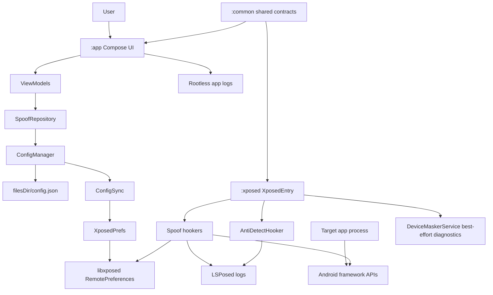
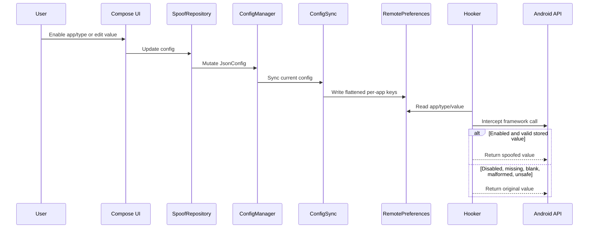

# Device Masker Agent Guide

Device Masker is an Android LSPosed/libxposed module for privacy research and controlled per-app device identity spoofing.

Current state: active development with a first working base. As of 2026-05-02, `com.mantle.verify` launched under LSPosed on `emulator-5554`, Device Masker hooks registered, and LSPosed logs showed live spoof events for multiple identifiers. This is not a stable release yet.

## Required First Step

Read every file in `memory-bank/` before architecture, implementation, review, debugging, or documentation work.

Core files:
- `memory-bank/projectbrief.md`
- `memory-bank/productContext.md`
- `memory-bank/systemPatterns.md`
- `memory-bank/techContext.md`
- `memory-bank/activeContext.md`
- `memory-bank/progress.md`

## Project Purpose

Device Masker lets users configure stable alternate identities for selected Android apps. The app writes configuration into local JSON and libxposed RemotePreferences. The LSPosed module reads RemotePreferences inside scoped target processes and intercepts selected Android framework APIs.

In scope:
- Per-app and per-group spoof configuration.
- Stable stored identity values.
- Android ID, device profile, telephony, SIM/carrier, network, Advertising ID, Media DRM, location, sensor, WebView, and package visibility hooks.
- Safer anti-detection surfaces: stack traces, package visibility, and maps filtering.
- Rootless app logs and LSPosed hook-side runtime logs.

Out of scope:
- Root hiding.
- Play Integrity, SafetyNet, or hardware attestation bypass.
- Bootloader or verified boot bypass.
- Fraud, ban evasion, or unauthorized access workflows.

## Architecture



### Config Flow



## Current Source Of Truth Rules

- `JsonConfig.appConfigs` is canonical for app assignment and enablement.
- `SpoofGroup.assignedApps` is legacy/display compatibility only.
- `SharedPrefsKeys` in `:common` is the only place to build preference keys.
- Config delivery is RemotePreferences-first.
- AIDL is diagnostics-only. Never use AIDL to deliver spoof config.
- Generators live in `:common`.
- Hookers must not generate fresh identifiers at runtime.
- LSPosed logs are authoritative proof of target-process hook registration and spoof events.
- App-side `XposedPrefs.isServiceConnected` proves service connection only; it does not prove a target app is hooked.

## Hook Safety Rules

Every hook should:
- Resolve classes and methods defensively.
- Use libxposed API 101 lambda interceptors.
- Call `xi.deoptimize(m)` for hooked methods.
- Call `chain.proceed()` when original values are needed.
- Return original results for unsafe config.
- Skip abstract or otherwise unhookable methods.
- Avoid static initializers that can throw in target processes.
- Avoid mutating framework-returned lists in place.

Never do this:
- Generate random fallback identifiers in `:xposed`.
- Return hardcoded fake defaults for malformed config.
- Read app-private JSON directly from target processes.
- Use Timber in `:xposed`.
- Hardcode RemotePreferences key strings.
- Use custom `ServiceManager` lookup from target app processes.
- Re-enable global `Class.forName` or `ClassLoader.loadClass` hooks without a per-app kill switch and fresh runtime validation.

## Anti-Detection State

Current active safer surfaces:
- Stack trace filtering.
- `/proc/self/maps` filtering.
- PackageManager/package list hiding.

Currently disabled by default:
- Global `Class.forName` hiding.
- Global `ClassLoader.loadClass` hiding.

Reason: global class lookup interception destabilized target app startup and was on the crash path for AndroidX Startup / WorkManager discovery. Reintroduce only behind a per-app safe-mode flag.

Intentional package/class hiding throws must use `ExceptionMode.PASSTHROUGH`.

## Working Base Evidence

Latest known good runtime:
- Device/emulator: `emulator-5554`.
- Target: `com.mantle.verify`.
- Result: target process stayed alive after startup.
- LSPosed logs showed `XposedEntry loaded`, `All hooks registered`, and spoof events.
- Spoof events included Android ID, carrier, network operator, IMEI, Wi-Fi MAC, Wi-Fi SSID, Advertising ID, Media DRM ID, and SIM operator name.

Previous crash signatures that should remain absent:
- `androidx.work.WorkManagerInitializer`
- WebView regex `PatternSyntaxException`
- `Cannot hook abstract methods` from WebView hooks
- `AbstractMethodError` from minified hooker lambdas
- class-loading ANR in `AntiDetectHooker`

## Important Files

| File | Role |
| --- | --- |
| `app/src/main/kotlin/com/astrixforge/devicemasker/DeviceMaskerApp.kt` | App initialization and wiring |
| `app/src/main/kotlin/com/astrixforge/devicemasker/data/XposedPrefs.kt` | App-side libxposed service and RemotePreferences |
| `app/src/main/kotlin/com/astrixforge/devicemasker/data/ConfigSync.kt` | Config flattening into RemotePreferences |
| `app/src/main/kotlin/com/astrixforge/devicemasker/service/ConfigManager.kt` | JSON config persistence |
| `app/src/main/kotlin/com/astrixforge/devicemasker/service/AppLogStore.kt` | Rootless app log store |
| `app/src/main/kotlin/com/astrixforge/devicemasker/service/LogManager.kt` | Minimal log export |
| `common/src/main/kotlin/com/astrixforge/devicemasker/common/JsonConfig.kt` | Root config model |
| `common/src/main/kotlin/com/astrixforge/devicemasker/common/SharedPrefsKeys.kt` | Preference key source of truth |
| `common/src/main/aidl/com/astrixforge/devicemasker/IDeviceMaskerService.aidl` | Diagnostics-only AIDL |
| `xposed/src/main/kotlin/com/astrixforge/devicemasker/xposed/XposedEntry.kt` | libxposed entry |
| `xposed/src/main/kotlin/com/astrixforge/devicemasker/xposed/hooker/BaseSpoofHooker.kt` | Shared hook safety helpers |
| `xposed/src/main/kotlin/com/astrixforge/devicemasker/xposed/hooker/AntiDetectHooker.kt` | Safer anti-detection hooks |
| `xposed/src/main/kotlin/com/astrixforge/devicemasker/xposed/hooker/WebViewHooker.kt` | Defensive WebView UA hook |

## Build And Verification

Primary full gate:

```powershell
.\gradlew.bat spotlessApply spotlessCheck :common:testDebugUnitTest :app:testDebugUnitTest :xposed:testDebugUnitTest lint test assembleDebug assembleRelease --no-daemon
```

Install debug APK:

```powershell
adb install -r app\build\outputs\apk\debug\app-debug.apk
```

Target smoke:

```powershell
adb shell am force-stop com.mantle.verify
adb logcat -c
adb shell monkey -p com.mantle.verify -c android.intent.category.LAUNCHER 1
adb shell pidof com.mantle.verify
adb logcat -d -t 1200
```

## Runtime Validation Requirements

- Rooted device/emulator.
- LSPosed with libxposed API 101 support.
- Device Masker enabled as an LSPosed module.
- Required scope: `android`, `system`, and selected target apps.
- Target app force-stopped and relaunched after scope/module/config changes.

## Documentation Rules

- Keep docs current with the development state.
- Do not describe AIDL as a config channel.
- Do not claim stable readiness from app launch alone.
- Mention LSPosed log evidence when claiming target hook success.
- Update Memory Bank after architecture, runtime validation, or hook safety changes.

## Known Gaps

- Broader target app validation is still required.
- Anti-detection is intentionally weaker while class lookup hooks are disabled.
- In-app diagnostics service is best-effort under SELinux.
- AGP and Spotless deprecation warnings remain cleanup work.
- Actual returned spoof values need more target-side verification beyond spoof event logs.

## Official Documentation

- [libxposed API](https://github.com/libxposed/api)
- [libxposed API reference](https://libxposed.github.io/api/)
- [libxposed service](https://github.com/libxposed/service)
- [libxposed service docs](https://libxposed.github.io/service/)
- [libxposed example](https://github.com/libxposed/example)
