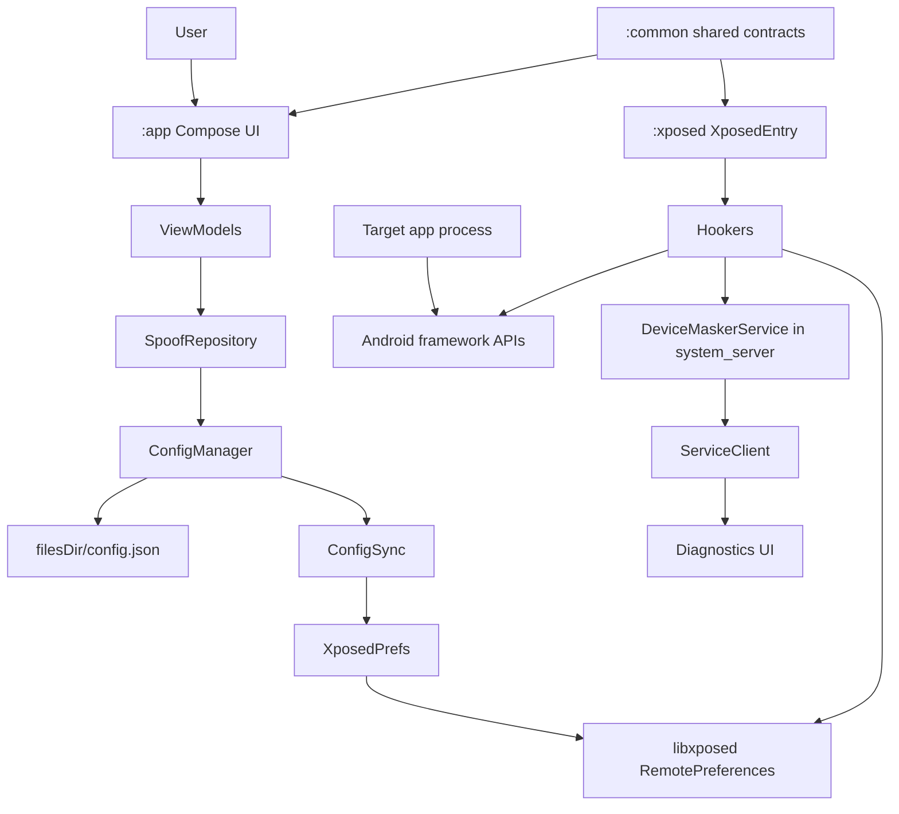
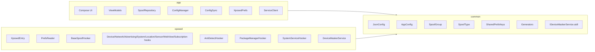
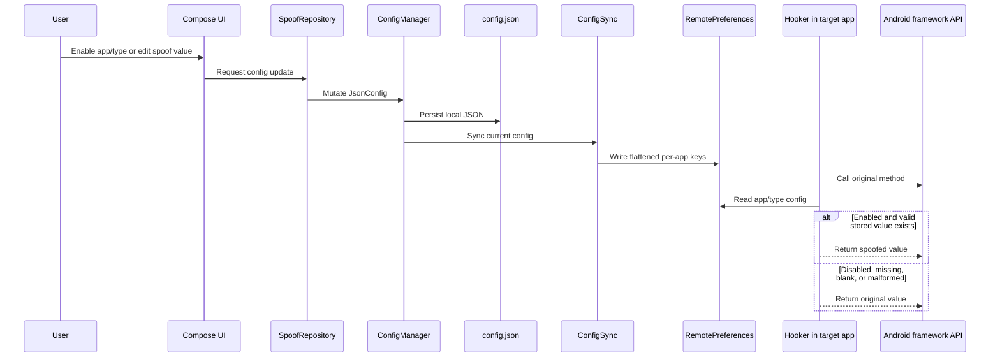
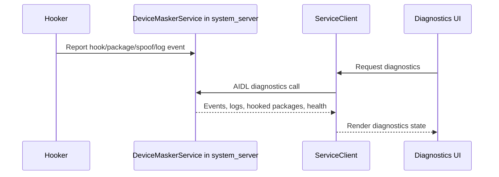

# Device Masker Agent Guide

Device Masker is an Android LSPosed/libxposed module for privacy research and controlled per-app device identity spoofing.

Current project state: active development, post-2026-05-02 architecture remediation. The app builds and launches, but target-app spoof behavior still requires live validation on a rooted LSPosed runtime.

## Required First Step

Read every file in `memory-bank/` before architecture, implementation, review, or debugging work. The Memory Bank is the current source of truth for project intent, patterns, status, and known gaps.

Core files:
- `memory-bank/projectbrief.md`
- `memory-bank/productContext.md`
- `memory-bank/systemPatterns.md`
- `memory-bank/techContext.md`
- `memory-bank/activeContext.md`
- `memory-bank/progress.md`

## Project Purpose

Device Masker lets users configure stable alternate identities for selected Android apps. The Android app writes configuration; the LSPosed/libxposed module reads that configuration inside target processes and intercepts selected Android framework APIs.

In scope:
- Device, SIM, network, advertising, system profile, location, sensor, WebView, and package visibility spoofing.
- Per-app and per-group configuration.
- Anti-detection for obvious Device Masker, LSPosed, and hook-framework traces.
- Diagnostics for hook registration, spoof events, logs, and health.

Out of scope:
- Root hiding.
- Play Integrity, SafetyNet, or hardware attestation bypass.
- Bootloader spoofing.
- Fraud or unauthorized access workflows.

## Architecture



### Module Responsibilities



### Config Flow



### Diagnostics Flow



## Current Source Of Truth Rules

- `JsonConfig.appConfigs` is the canonical per-app assignment and enablement table.
- `SpoofGroup.assignedApps` is legacy/display compatibility and must not override `appConfigs`.
- Config delivery is RemotePreferences-first.
- AIDL is diagnostics-only. Do not use AIDL to deliver spoof config.
- `SharedPrefsKeys` in `:common` is the only place to generate preference keys.
- Generators live in `:common`; hookers must not generate fresh identifiers at runtime.
- Hookers return original framework values when config is disabled, missing, blank, malformed, or unsafe.
- Full config sync must clear stale package keys.
- `XposedPrefs.isServiceConnected` is app-side service health. It does not prove a target app is hooked.

## Hook Safety Rules

Every hook should:
- Resolve classes and methods defensively.
- Use libxposed API 101 lambda interceptors.
- Call the original API first when the original value is needed for safe fallback.
- Call `xi.deoptimize(m)` for hooked methods.
- Return original results for unsafe config.
- Avoid mutating framework-returned lists in place.
- Avoid crashing target apps or `system_server`.

Never do this in hook callbacks:
- Generate random fallback identifiers.
- Return hardcoded fake defaults for malformed config.
- Read app-private JSON files directly.
- Use Timber in `:xposed`.
- Hardcode RemotePreferences key strings.

Intentional anti-detection throws must use `ExceptionMode.PASSTHROUGH`.

## Important Files

| File | Role |
| --- | --- |
| `app/src/main/kotlin/com/astrixforge/devicemasker/DeviceMaskerApp.kt` | App initialization and service/config wiring |
| `app/src/main/kotlin/com/astrixforge/devicemasker/data/XposedPrefs.kt` | App-side libxposed service and RemotePreferences access |
| `app/src/main/kotlin/com/astrixforge/devicemasker/data/ConfigSync.kt` | Flattens `JsonConfig` into RemotePreferences |
| `app/src/main/kotlin/com/astrixforge/devicemasker/service/ConfigManager.kt` | Local JSON persistence and config state |
| `app/src/main/kotlin/com/astrixforge/devicemasker/data/repository/SpoofRepository.kt` | UI-facing config repository |
| `common/src/main/kotlin/com/astrixforge/devicemasker/common/JsonConfig.kt` | Root config model and migration helpers |
| `common/src/main/kotlin/com/astrixforge/devicemasker/common/SharedPrefsKeys.kt` | Single source of truth for preference keys |
| `common/src/main/aidl/com/astrixforge/devicemasker/IDeviceMaskerService.aidl` | Diagnostics-only Binder contract |
| `xposed/src/main/kotlin/com/astrixforge/devicemasker/xposed/XposedEntry.kt` | libxposed module entry point |
| `xposed/src/main/kotlin/com/astrixforge/devicemasker/xposed/PrefsReader.kt` | Hook-side RemotePreferences reader |
| `xposed/src/main/kotlin/com/astrixforge/devicemasker/xposed/hooker/BaseSpoofHooker.kt` | Shared hook utilities |
| `xposed/src/main/kotlin/com/astrixforge/devicemasker/xposed/service/DeviceMaskerService.kt` | system_server diagnostics service |

## Tech Stack

| Area | Current |
| --- | --- |
| Language | Kotlin 2.3.0 |
| Android | compile/target SDK 36, min SDK 26 |
| Build | Android Gradle Plugin 9.2.0 |
| Java target | JVM 21 |
| UI | Jetpack Compose BOM 2026.02.01 |
| Material | Material 3 1.4.0 |
| Navigation | Navigation Compose 2.9.7 |
| Hooking | libxposed API 101.0.1 |
| App-side libxposed service/interface | 101.0.0 |
| Config | Local JSON plus libxposed RemotePreferences |
| IPC | AIDL diagnostics only |
| Serialization | kotlinx.serialization JSON 1.10.0 |
| Coroutines | kotlinx.coroutines 1.10.2 |
| Logging | Timber in `:app`, DualLog in `:xposed` |

## Build And Verification

Primary full gate:

```powershell
.\gradlew.bat spotlessApply spotlessCheck :common:testDebugUnitTest :app:testDebugUnitTest :xposed:testDebugUnitTest lint test assembleDebug assembleRelease --no-daemon
```

Targeted commands:

```powershell
.\gradlew.bat :app:compileDebugKotlin --no-daemon
.\gradlew.bat :common:testDebugUnitTest --no-daemon
.\gradlew.bat :app:testDebugUnitTest --no-daemon
.\gradlew.bat :xposed:testDebugUnitTest --no-daemon
.\gradlew.bat assembleDebug --no-daemon
```

Static safety greps that should return no matches:

```powershell
Get-ChildItem -Path xposed/src -Recurse -Filter '*.kt' | Select-String '@XposedHooker|@BeforeInvocation|@AfterInvocation|AfterHookCallback'
Get-ChildItem -Path app/src,xposed/src -Recurse -Filter '*.kt' | Select-String '"module_enabled"|"app_enabled_"|"spoof_value_"|"spoof_enabled_"'
Get-ChildItem -Path common/src -Recurse -Filter '*.kt' | Select-String 'Random\(\)' | Where-Object { $_ -notmatch 'SecureRandom' }
Get-ChildItem -Path xposed/src -Recurse -Filter '*.kt' | Select-String 'Timber\.'
Get-ChildItem -Path common/src,xposed/src -Recurse -Filter '*.kt' | Select-String 'import androidx.compose'
Get-ChildItem -Path xposed/src/main/kotlin -Recurse -Filter '*.kt' | Select-String 'IMEIGenerator|IMSIGenerator|ICCIDGenerator|MACGenerator|UUIDGenerator|PhoneNumberGenerator|SerialGenerator|\{ "(us|Carrier|310260|HomeNetwork)" \}|ByteArray\(32\)|\?: 310|\?: 260'
```

Runtime validation requires:
- Rooted device or emulator.
- LSPosed with libxposed API 101 support.
- Device Masker enabled as an LSPosed module.
- Required scope enabled: `android`, `system`, and selected target apps as applicable.
- Target apps force-stopped and relaunched after scope or module changes.

App launch alone does not prove target-process hooks work.

## Xposed Metadata

Files:
- `xposed/src/main/resources/META-INF/xposed/java_init.list`
- `xposed/src/main/resources/META-INF/xposed/module.prop`
- `xposed/src/main/resources/META-INF/xposed/scope.list`

Current expectations:
- Entry point: `com.astrixforge.devicemasker.xposed.XposedEntry`
- `minApiVersion=101`
- `targetApiVersion=101`
- `staticScope=false`
- Default scope includes `android` and `system`

## Coding Rules

- Keep changes surgical and tied to the requested task.
- Match existing Kotlin and Compose patterns.
- Use `StateFlow` and immutable state for UI state.
- Keep shared contracts in `:common`.
- Keep hook logic in `:xposed`.
- Keep UI code in `:app`.
- Do not duplicate shared models across modules.
- Do not add abstractions for single-use code.
- Do not refactor unrelated code.
- Use `SharedPrefsKeys` for all app/xposed preference keys.
- Update Memory Bank when architecture, project status, or important patterns change.

## Documentation Rules

- Keep docs accurate to the current development architecture.
- Remove stale claims instead of preserving historical noise.
- Do not describe AIDL as a config channel.
- Do not claim stable release readiness until target-app LSPosed validation passes.
- Prefer compact diagrams and tables over long duplicated prose.

## Current Known Gaps

- Live target-app hook validation is still pending.
- The app that previously stuck on its logo must be retested under LSPosed.
- Anti-detection behavior needs target-process verification.
- Diagnostics service registration in `system_server` needs runtime confirmation.
- AGP/Spotless deprecation warnings remain cleanup work.

### Official Documentation & Repositories (`context7`) 

- **LibXposed**:
  - [API Reference](https://libxposed.github.io/api/)
  - [API](https://github.com/libxposed/api)
  - [Helper](https://github.com/libxposed/helper)
  - [Service](https://github.com/libxposed/service)
  - [Service](https://libxposed.github.io/service/)
  - [Example](https://github.com/libxposed/example)
