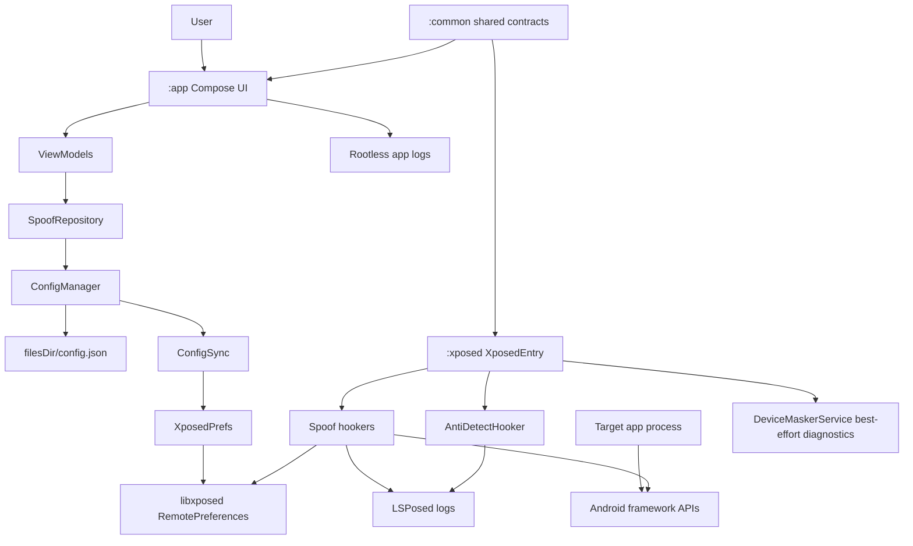
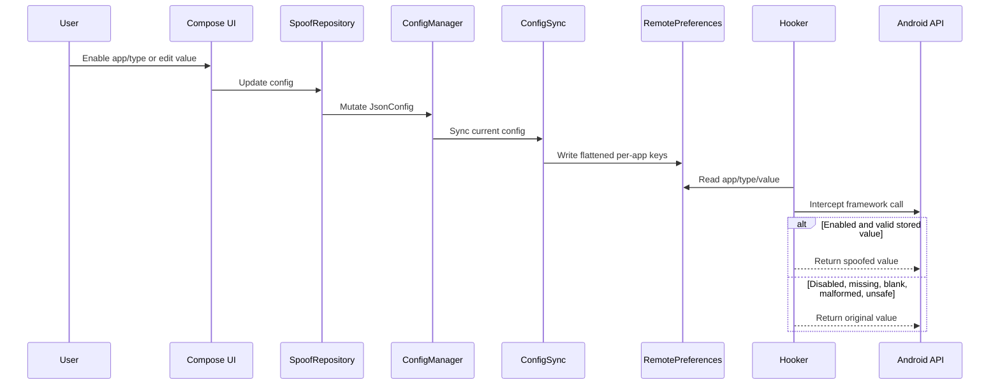

# Device Masker Agent Guide

Device Masker is an Android LSPosed/libxposed module for privacy research and controlled per-app device identity spoofing.

## Project Purpose

Device Masker lets users configure stable alternate identities for selected Android apps. The app writes configuration into local JSON and libxposed RemotePreferences. The LSPosed module reads RemotePreferences inside scoped target processes and intercepts selected Android framework APIs.

In scope:

- Per-app and per-group spoof configuration.
- Stable stored identity values.
- Android ID, device profile, telephony, SIM/carrier, network, Advertising ID, Media DRM, location, sensor, WebView, and package visibility hooks.
- Safer anti-detection surfaces: stack traces, package visibility, and maps filtering.
- Rootless app logs and LSPosed hook-side runtime logs.
- Local-first structured diagnostics, redacted support bundles, and opt-in root maximum evidence collection.

Out of scope:

- Root hiding.
- Play Integrity, SafetyNet, or hardware attestation bypass.
- Bootloader or verified boot bypass.
- Fraud, ban evasion, or unauthorized access workflows.

## Project Structure

```
devicemasker/
├── app/                  :app module — Compose UI, config, diagnostics, root capture
│   └── src/main/kotlin/com/astrixforge/devicemasker/
│       ├── data/             RemotePreferences writer, config sync, repositories
│       ├── service/          ConfigManager, log store, AIDL client, diagnostics
│       ├── ui/               MainActivity, screens, navigation, theme, components
│       └── utils/            Image utilities
│
├── common/               :common module — shared contracts, models, generators
│   └── src/main/
│       ├── kotlin/.../common/
│       │   ├── models/       Carrier, SIMConfig, DeviceHardwareConfig, LocationConfig, Country
│       │   ├── generators/   IMEI, IMSI, ICCID, MAC, Serial, UUID, PhoneNumber, Fingerprint
│       │   ├── diagnostics/  DiagnosticEvent schema, redactor
│       │   └── (root)        JsonConfig, AppConfig, SpoofGroup, SpoofType, SharedPrefsKeys, PersonaGenerator
│       └── aidl/             IDeviceMaskerService (diagnostics-only)
│
├── xposed/               :xposed module — hooks in target app processes
│   └── src/main/
│       ├── kotlin/.../xposed/
│       │   ├── hooker/       11 hookers + BaseSpoofHooker + AntiDetectHooker
│       │   ├── service/      DeviceMaskerService (system_server AIDL), log buffer
│       │   ├── diagnostics/  Event sink, hook health registry
│       │   └── (root)        XposedEntry, PrefsReader, DualLog, DeoptimizeManager
│       └── resources/META-INF/xposed/   java_init.list, module.prop, scope.list
│
├── gradle/               Version catalog (libs.versions.toml)
├── docs/                 Reports, guides, plans
├── scripts/              Build/verification scripts
├── build.gradle.kts      Root build config + Spotless formatting
├── settings.gradle.kts   Module includes + repositories
├── lint.xml              Lint exclusions
└── gradle.properties     JVM args, R8, build features
```

## Architecture



### Config Flow



## Current Source Of Truth Rules

- `JsonConfig.appConfigs` is canonical for app assignment and enablement.
- `SpoofGroup.assignedApps` is legacy/display compatibility only.
- `SharedPrefsKeys` in `:common` is the only place to build preference keys.
- Config delivery is RemotePreferences-first.
- AIDL is diagnostics-only. Never use AIDL to deliver spoof config.
- Diagnostics are local-first. Do not add cloud logging, crash SDKs, analytics SDKs, or network telemetry.
- Redacted export is the default. Never log raw identifiers by default.
- Root Maximum export is opt-in and requires root; root output must be bounded and redacted before export.
- Generators live in `:common`.
- Hookers must not generate fresh identifiers at runtime.
- LSPosed logs are authoritative proof of target-process hook registration and spoof events.
- App-side `XposedPrefs.isServiceConnected` proves service connection only; it does not prove a target app is hooked.

## Hook Safety Rules

Every hook should:

- Resolve classes and methods defensively.
- Use libxposed API 101 through `intercept(stableHooker { ... })` or explicit named
  `XposedInterface.Hooker` implementations. Direct Kotlin SAM `.intercept { ... }` callbacks are
  forbidden in runtime hookers because release R8 caused `AbstractMethodError` in target processes.
- Call `xi.deoptimize(m)` for hooked methods.
- Call `chain.proceed()` when original values are needed.
- Return original results for unsafe config.
- Skip abstract or otherwise unhookable methods.
- Avoid static initializers that can throw in target processes.
- Avoid mutating framework-returned lists in place.

Never do this:

- Generate random fallback identifiers in `:xposed`.
- Return hardcoded fake defaults for malformed config.
- Read app-private JSON directly from target processes.
- Use Timber in `:xposed`.
- Hardcode RemotePreferences key strings.
- Use custom `ServiceManager` lookup from target app processes.
- Register runtime hooks with direct Kotlin SAM callbacks such as `xi.hook(m).intercept { ... }`.
- Re-enable global `Class.forName` or `ClassLoader.loadClass` hooks without a per-app kill switch and fresh runtime validation.

## Critical libxposed/Xposed Practices

Use the local `libxposed` skill before any Xposed/libxposed implementation, review, debugging, or documentation work. The modern API differs from legacy XposedBridge in ways that can compile but fail silently at runtime.

### API 101 Contract

- Module entry classes must extend `io.github.libxposed.api.XposedModule` and use the framework-created no-arg constructor.
- Use the modern lifecycle names exactly:
  - `onModuleLoaded(ModuleLoadedParam)`
  - `onPackageReady(PackageReadyParam)` for most app hooks
  - `onSystemServerStarting(SystemServerStartingParam)` for system-server setup
- Do not invent or use legacy callback names such as `onSystemServerLoaded`, `onServiceConnected`, `onScopeRequestGranted`, `beforeHookedMethod`, or `afterHookedMethod`.
- `:xposed` must keep `io.github.libxposed:api` as `compileOnly`; add it to test runtime only when local unit tests instantiate code that references API classes.
- `java_init.list` must contain `com.astrixforge.devicemasker.xposed.XposedEntry`.
- `module.prop` must keep `minApiVersion=101` and `targetApiVersion=101`.
- `scope.list` must keep `android` and `system`; target apps still need LSPosed scope plus force-stop/relaunch after changes.

### Chain And Hook Calls

- `chain.args` / `chain.getArgs()` is immutable. Never assign into it.
- To change arguments, copy the args and call `chain.proceed(Object[])`.
- Use `chain.proceed()` whenever the original value is needed for fallback.
- Do not pass a `List` to `chain.proceed`; libxposed expects `Object[]`.
- `chain.thisObject` can be `null` for static methods and constructors.
- Skip abstract methods and other unhookable declarations before calling `xi.hook(m)`.
- Register callbacks with `intercept(stableHooker { ... })` or explicit named
  `XposedInterface.Hooker` implementations; do not use direct Kotlin SAM `.intercept { ... }`.
- Call `xi.deoptimize(m)` after registering hooks for methods where ART/JIT inlining can bypass the hook.

### Error Handling

- `HookFailedError` extends `XposedFrameworkError`, which extends `Error`.
- Hook registration and deoptimization wrappers must rethrow `XposedFrameworkError` before generic `Throwable` fallback handling.
- Keep ordinary reflection/OEM API variation failures isolated so one missing method does not block unrelated hooks.
- Intentional app-visible throws for anti-detection package/class hiding must use `ExceptionMode.PASSTHROUGH`.
- Do not hide libxposed framework errors behind "safe" logging fallbacks.

### Config And Identity Semantics

- RemotePreferences is the config delivery channel. AIDL is diagnostics-only.
- App-side config sync should use explicit `commit()` when sync success matters.
- `JsonConfig.appConfigs` is canonical for app assignment and enablement; `SpoofGroup.assignedApps` is legacy/display compatibility.
- `SharedPrefsKeys` in `:common` is the only source for RemotePreferences key names.
- Hookers must read stored values and return originals for disabled, missing, blank, malformed, unsafe, or unsupported config.
- Hookers must not generate fresh identifiers at runtime.
- Do not read app-private JSON files from target processes.
- Some hooks intentionally read config at registration time. Do not claim full live update behavior for those hooks unless callback-time reads are implemented and runtime-tested.

### Process And Scope Behavior

- libxposed may invoke package callbacks multiple times in one process.
- `XposedEntry` uses process/package selection and one hook registration per classloader to avoid duplicate hook chains.
- One classloader still has one effective hook package. Do not assume true simultaneous per-package identities inside a shared process.
- App-side `XposedPrefs.isServiceConnected` proves only libxposed service binding; it does not prove any target app is scoped, hooked, or spoofed.
- LSPosed logs are the authoritative target-process evidence for hook registration and spoof events.

### Anti-Detection Stability

- Keep safer anti-detection surfaces focused on stack traces, package visibility, and `/proc/self/maps`.
- Keep global `Class.forName` and `ClassLoader.loadClass` hooks disabled by default.
- Reintroduce global class lookup hiding only behind a per-app kill switch and fresh runtime validation.
- Avoid static initializers in hookers that can throw during target startup.
- Target app processes must not discover the custom diagnostics service through `ServiceManager`; diagnostics service access is best-effort and system-server/app-side only.

### Runtime Validation

Before claiming Xposed behavior works:

- Run the relevant unit/static tests.
- Build and install the APK variant being validated. For release/R8 validation, use the minified
  release APK and keep R8 enabled.
- Ensure LSPosed scope includes `android`, `system`, and the selected target app.
- Force-stop and relaunch the target app after scope/module/config changes.
- Check LSPosed logs for `XposedEntry loaded`, hook registration, and spoof events.
- Verify actual returned spoof values inside target apps when possible, not only app launch or service connection.
- After hook safety or R8 callback changes, run `R8HookerAbiTest`, re-test `com.mantle.verify`, and
  validate at least one more target such as `flar2.devcheck`. Do not claim stable release readiness
  from app launch, service connection, or one target alone.

## Anti-Detection State

Current active safer surfaces:

- Stack trace filtering.
- `/proc/self/maps` filtering.
- PackageManager/package list hiding.

Currently disabled by default:

- Global `Class.forName` hiding.
- Global `ClassLoader.loadClass` hiding.

Reason: global class lookup interception destabilized target app startup and was on the crash path for AndroidX Startup / WorkManager discovery. Reintroduce only behind a per-app safe-mode flag.

Intentional package/class hiding throws must use `ExceptionMode.PASSTHROUGH`.

## Working Base Evidence

Latest known good runtime:

- Device/emulator: `emulator-5554`.
- Target: `com.mantle.verify`.
- Result: target process stayed alive after startup.
- LSPosed logs showed `XposedEntry loaded`, `All hooks registered`, and spoof events.
- Spoof events included Android ID, carrier, network operator, IMEI, Wi-Fi MAC, Wi-Fi SSID, Advertising ID, Media DRM ID, and SIM operator name.

Previous crash signatures that should remain absent:

- `androidx.work.WorkManagerInitializer`
- WebView regex `PatternSyntaxException`
- `Cannot hook abstract methods` from WebView hooks
- `AbstractMethodError` from minified hooker lambdas
- class-loading ANR in `AntiDetectHooker`

## Important Files

| File                                                                                    | Role                                             |
| --------------------------------------------------------------------------------------- | ------------------------------------------------ |
| `app/src/main/kotlin/com/astrixforge/devicemasker/DeviceMaskerApp.kt`                   | App initialization and wiring                    |
| `app/src/main/kotlin/com/astrixforge/devicemasker/data/XposedPrefs.kt`                  | App-side libxposed service and RemotePreferences |
| `app/src/main/kotlin/com/astrixforge/devicemasker/data/ConfigSync.kt`                   | Config flattening into RemotePreferences         |
| `app/src/main/kotlin/com/astrixforge/devicemasker/service/ConfigManager.kt`             | JSON config persistence                          |
| `app/src/main/kotlin/com/astrixforge/devicemasker/service/AppLogStore.kt`               | Rootless app log store                           |
| `app/src/main/kotlin/com/astrixforge/devicemasker/service/LogManager.kt`                | Minimal log export                               |
| `common/src/main/kotlin/com/astrixforge/devicemasker/common/JsonConfig.kt`              | Root config model                                |
| `common/src/main/kotlin/com/astrixforge/devicemasker/common/SharedPrefsKeys.kt`         | Preference key source of truth                   |
| `common/src/main/aidl/com/astrixforge/devicemasker/IDeviceMaskerService.aidl`           | Diagnostics-only AIDL                            |
| `xposed/src/main/kotlin/com/astrixforge/devicemasker/xposed/XposedEntry.kt`             | libxposed entry                                  |
| `xposed/src/main/kotlin/com/astrixforge/devicemasker/xposed/hooker/BaseSpoofHooker.kt`  | Shared hook safety helpers                       |
| `xposed/src/main/kotlin/com/astrixforge/devicemasker/xposed/hooker/AntiDetectHooker.kt` | Safer anti-detection hooks                       |
| `xposed/src/main/kotlin/com/astrixforge/devicemasker/xposed/hooker/WebViewHooker.kt`    | Defensive WebView UA hook                        |

## Build And Verification

Primary full gate:

```powershell
.\gradlew.bat spotlessApply spotlessCheck :common:testDebugUnitTest :app:testDebugUnitTest :xposed:testDebugUnitTest lint test assembleDebug assembleRelease --no-daemon
```

Install debug APK:

```powershell
adb install -r app\build\outputs\apk\debug\app-debug.apk
```

Target smoke:

```powershell
adb shell am force-stop com.mantle.verify
adb logcat -c
adb shell monkey -p com.mantle.verify -c android.intent.category.LAUNCHER 1
adb shell pidof com.mantle.verify
adb logcat -d -t 1200
```

## Runtime Validation Requirements

- Rooted device/emulator.
- LSPosed with libxposed API 101 support.
- Device Masker enabled as an LSPosed module.
- Required scope: `android`, `system`, and selected target apps.
- Target app force-stopped and relaunched after scope/module/config changes.
- Installed APK variant matches the claim being made; release/R8 claims require the minified release APK with R8 enabled.
- LSPosed/logcat evidence shows `XposedEntry loaded`, target selection, `All hooks registered`, and spoof events.
- Actual returned spoof values are checked in target apps when possible; app launch and service connection alone are not hook proof.
- After hook safety or R8 callback changes, run `R8HookerAbiTest`, re-test `com.mantle.verify`, and validate at least one more target such as `flar2.devcheck`.

## Documentation Rules

- Keep docs current with the development state.
- Do not describe AIDL as a config channel.
- Do not claim stable readiness from app launch alone.
- Mention LSPosed log evidence when claiming target hook success.
- Update Memory Bank after architecture, runtime validation, or hook safety changes.

## Known Gaps

- Broader target app validation is still required.
- Anti-detection is intentionally weaker while class lookup hooks are disabled.
- In-app diagnostics service is best-effort under SELinux.
- AGP and Spotless deprecation warnings remain cleanup work.
- Actual returned spoof values need more target-side verification beyond spoof event logs.

## Official Libxposed Documentation (Never Skip THis)

- All you know about lsposed/xposed api are outdated so alwasy fetch latest docs and libxposed skills to know correctly about libxposed api, services, helper, example.

### Skills

@.agents\skills\libxposed\SKILL.md

### Github Repo

- [libxposed API](https://github.com/libxposed/api)
- [libxposed service](https://github.com/libxposed/service)
- [libxposed example](https://github.com/libxposed/example)

### Javadoc

- [libxposed API javadoc](https://libxposed.github.io/api/)
- [libxposed service javadoc](https://libxposed.github.io/service/)

## graphify

This project has a graphify knowledge graph at graphify-out/.

Rules:

- Before answering architecture or codebase questions, read graphify-out/GRAPH_REPORT.md for god nodes and community structure
- If graphify-out/wiki/index.md exists, navigate it instead of reading raw files
- For cross-module "how does X relate to Y" questions, prefer `graphify query "<question>"`, `graphify path "<A>" "<B>"`, or `graphify explain "<concept>"` over grep — these traverse the graph's EXTRACTED + INFERRED edges instead of scanning files
- After modifying code files in this session, run `graphify update .` to keep the graph current (AST-only, no API cost)
