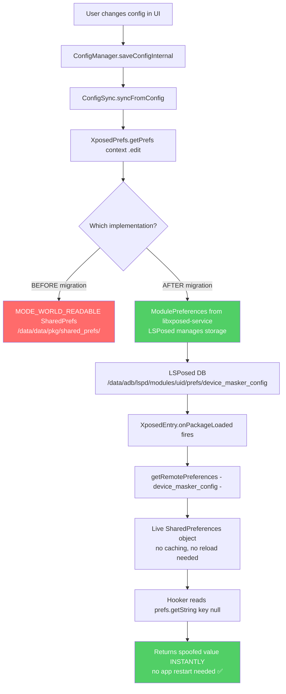
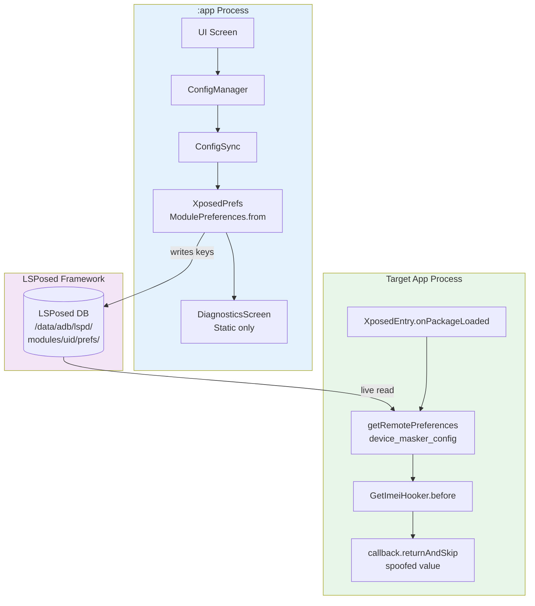
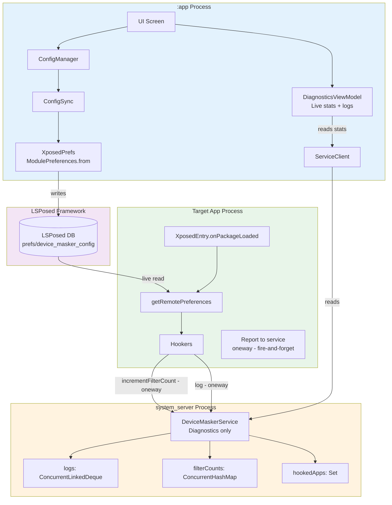

# Device Masker — Storage & IPC Architecture
## Option A vs Option B: Complete Analysis, Implementation & Migration Guide

> **Context:** Post libxposed API 100 migration  
> **Scope:** How the UI (`:app`) and hookers (`:xposed`) communicate configuration and diagnostics  
> **Decision point:** What to do with the existing AIDL service after RemotePreferences takes over config delivery

---

## Table of Contents

1. [Current System — Baseline State](#1-current-system--baseline-state)
2. [Why the Current System Has Problems](#2-why-the-current-system-has-problems)
3. [What Changes With RemotePreferences (Both Options)](#3-what-changes-with-remotepreferences-both-options)
4. [Option A — Full AIDL Removal](#4-option-a--full-aidl-removal)
5. [Option B — AIDL Demoted to Diagnostics Only](#5-option-b--aidl-demoted-to-diagnostics-only)
6. [Side-by-Side Comparison](#6-side-by-side-comparison)
7. [Decision Framework](#7-decision-framework)
8. [Option A — Complete Implementation](#8-option-a--complete-implementation)
9. [Option B — Complete Implementation](#9-option-b--complete-implementation)
10. [Shared Changes (Both Options)](#10-shared-changes-both-options)
11. [File Change Index](#11-file-change-index)
12. [Resource Links](#12-resource-links)

---

## 1. Current System — Baseline State

Before any migration, this is exactly what you have:

```
╔══════════════════════════════════════════════════════════════════════════════╗
║                     CURRENT ARCHITECTURE (Jan 2026)                        ║
╠══════════════════════════════════════════════════════════════════════════════╣
║                                                                              ║
║  ┌─────────────────────────────────────────────────────────────────────┐    ║
║  │                        :app PROCESS                                 │    ║
║  │                                                                     │    ║
║  │  UI → ConfigManager → saveConfigInternal()                         │    ║
║  │              │                                                      │    ║
║  │              ├─── [PATH 1] configFile.writeText(json)              │    ║
║  │              │    → /data/data/com.astrixforge.devicemasker/        │    ║
║  │              │      files/config.json                               │    ║
║  │              │                                                      │    ║
║  │              ├─── [PATH 2] ConfigSync.syncFromConfig()              │    ║
║  │              │    → XposedPrefs.getPrefs(context).edit()           │    ║
║  │              │    → SharedPrefs (MODE_WORLD_READABLE)              │    ║
║  │              │    → Keys: "spoof_enabled_pkg_IMEI" = true          │    ║
║  │              │    → Keys: "spoof_value_pkg_IMEI" = "35xxx"         │    ║
║  │              │                                                      │    ║
║  │              └─── [PATH 3] serviceClient.writeConfig(json)         │    ║
║  │                   → Binder IPC call to system_server               │    ║
║  └─────────────────────────────────────────────────────────────────────┘    ║
║                    │ PATH 2                      │ PATH 3                   ║
║                    ▼                             ▼                          ║
║  ┌──────────────────────────┐    ┌──────────────────────────────────────┐  ║
║  │  XSharedPreferences      │    │  system_server PROCESS               │  ║
║  │  (World-Readable File)   │    │                                      │  ║
║  │                          │    │  DeviceMaskerService (AIDL Stub)     │  ║
║  │  Path: /data/data/       │    │  ├── config: AtomicRef<JsonConfig>   │  ║
║  │  .../shared_prefs/       │    │  ├── logs: ConcurrentLinkedDeque     │  ║
║  │  device_masker_config.xml│    │  ├── filterCounts: ConcurrentHashMap │  ║
║  │                          │    │  └── hookedApps: Set<String>         │  ║
║  │  ⚠️  CACHED — stale      │    │                                      │  ║
║  │  after config change     │    │  ConfigManager                       │  ║
║  │  until app restarts      │    │  └── /data/misc/devicemasker/        │  ║
║  └──────────────────────────┘    │      config.json (atomic write)      │  ║
║           ↑ reads                └──────────────────────────────────────┘  ║
║           │                                     ↑ binder                  ║
║  ┌─────────────────────────────────────────────────────────────────────┐    ║
║  │                    TARGET APP PROCESS                               │    ║
║  │                                                                     │    ║
║  │  BaseSpoofHooker.getSpoofValue(SpoofType.IMEI)                     │    ║
║  │    ├── TRY 1: service?.getSpoofValue(pkg, "IMEI")  [real-time]    │    ║
║  │    │         → direct call if in same-process (system_server)      │    ║
║  │    │         → binder call if in separate process                  │    ║
║  │    └── TRY 2: prefs.getString("spoof_value_pkg_IMEI", null)       │    ║
║  │              → XSharedPreferences read (may be STALE)              │    ║
║  └─────────────────────────────────────────────────────────────────────┘    ║
╚══════════════════════════════════════════════════════════════════════════════╝
```

### The 15 AIDL Methods Currently in `IDeviceMaskerService`

Grouped by purpose — this is critical to understand for the Option A/B decision:

```
IDeviceMaskerService (15 methods)
│
├── CONFIG GROUP (can be replaced by RemotePreferences)
│   ├── writeConfig(String json)          ← app writes config to service
│   ├── readConfig(): String              ← app reads config back
│   ├── reloadConfig()                    ← force reload from disk
│   ├── isModuleEnabled(): Boolean        ← query module state
│   ├── isAppEnabled(String pkg): Boolean ← query per-app state
│   └── getSpoofValue(String pkg, String key): String  ← HOOKS use this
│
├── STATISTICS GROUP (UI diagnostics — unique value)
│   ├── incrementFilterCount(String pkg)  ← hooks report spoof events
│   ├── getFilterCount(String pkg): Int   ← app reads per-app count
│   └── getHookedAppCount(): Int          ← app reads total hooked apps
│
├── LOGGING GROUP (UI diagnostics — unique value)
│   ├── log(String tag, String msg, int level)  ← hooks report events
│   ├── getLogs(int maxCount): List<String>     ← app reads log buffer
│   └── clearLogs()                             ← app clears log buffer
│
└── CONTROL GROUP
    ├── isServiceAlive(): Boolean          ← health check
    └── getVersion(): String              ← service version
    (implied 15th: getUptime or similar)
```

**The critical insight:** Only the CONFIG GROUP methods can be replaced by RemotePreferences.  
The STATISTICS and LOGGING GROUP methods have **no equivalent** in RemotePreferences.  
These are a **one-way reporting channel** from hooks → service → UI.

---

## 2. Why the Current System Has Problems

```
PROBLEM MAP
═══════════

Problem 1: XSharedPreferences Is a Stale Cache
───────────────────────────────────────────────
app writes config → file on disk → hooked app reads once at load → CACHES it
                                                                        ↓
                              user changes IMEI in UI ──────────────────┘
                                      ↓
                    XSharedPreferences.reload() is called (best case)
                                      ↓
                    BUT: hooked app already ran, values already served
                    CONFIG CHANGE DOES NOT APPLY UNTIL APP RESTARTS ❌

Problem 2: MODE_WORLD_READABLE Is Deprecated
──────────────────────────────────────────────
Context.MODE_WORLD_READABLE = deprecated since Android 7 (API 24)
On Android 9+: throws SecurityException in strict mode
On Android 12+: increasingly unreliable with restricted storage
LSPosed works around it, but it's a fragility point

Problem 3: AIDL Service Is a Boot-Time Single Point of Failure
──────────────────────────────────────────────────────────────
SystemServiceHooker hooks ActivityManagerService.main()
       ↓
If that hook fails: service never initializes
       ↓
BaseSpoofHooker.service == null
       ↓
Falls back to XSharedPreferences (Problem 1 returns)
       ↓
Also: if system_server crashes due to AIDL init, BOOTLOOP ❌

Problem 4: getSpoofValue() Is Called Per Hook Invocation
─────────────────────────────────────────────────────────
Every time getImei() fires in a target app:
  service?.getSpoofValue(pkg, "IMEI")
       ↓
This is a binder call to system_server
       ↓
Binder calls have ~50-200μs latency
       ↓
getImei() may be called dozens of times per second in some apps
       ↓
50-200μs × many calls = measurable overhead ❌
```

---

## 3. What Changes With RemotePreferences (Both Options)

This is the foundation layer — it applies to **both** Option A and B.



### Key Facts About RemotePreferences

```
RemotePreferences vs XSharedPreferences vs AIDL config
═══════════════════════════════════════════════════════

                    XSharedPrefs    AIDL Service    RemotePrefs
                    ────────────    ────────────    ───────────
Live updates?           ❌              ✅              ✅
App restart needed?     ✅              ❌              ❌
Per-call latency        ~1μs           50-200μs        ~5μs
Storage location        World-file     /data/misc/     LSPosed DB
Write side              App writes     App → binder    App writes
Read side               File read      Binder call     LSPosed IPC
Boot dependency         None           system_server   LSPosed itself
Failure mode            Stale data     Bootloop risk   Module disabled
Change listener         None           None            None (always live)
```

**The `XposedPrefs.kt` change is just ONE LINE:**

```kotlin
// BEFORE — in XposedPrefs.kt
fun getPrefs(context: Context): SharedPreferences =
    context.getSharedPreferences("device_masker_config", Context.MODE_WORLD_READABLE)

// AFTER — same file, same method signature, same return type
// ModulePreferences is from libxposed-service.aar
fun getPrefs(context: Context): SharedPreferences =
    ModulePreferences.from(context, "device_masker_config")
```

`ConfigSync.kt` is **completely unchanged**. It still calls `XposedPrefs.getPrefs(context).edit()` and writes the same keys. The keys are unchanged. `SharedPrefsKeys.kt` is **completely unchanged**. The only change is *where* the data is stored — LSPosed manages it instead of a world-readable file.

---

## 4. Option A — Full AIDL Removal

### What It Is

Remove every AIDL-related file from the project. The module becomes a pure RemotePreferences + local JSON file architecture. Config flows one way: UI writes → LSPosed stores → hooks read. No binder, no system_server service, no ServiceClient.

```
╔══════════════════════════════════════════════════════════════════════════════╗
║                         OPTION A — FINAL ARCHITECTURE                      ║
╠══════════════════════════════════════════════════════════════════════════════╣
║                                                                              ║
║  ┌─────────────────────────────────────────────────────────────────────┐    ║
║  │                        :app PROCESS                                 │    ║
║  │                                                                     │    ║
║  │  UI → ConfigManager → saveConfigInternal()                         │    ║
║  │              │                                                      │    ║
║  │              ├─── configFile.writeText(json)  [local backup]       │    ║
║  │              │                                                      │    ║
║  │              └─── ConfigSync → ModulePreferences.edit()            │    ║
║  │                   → LSPosed DB (live, always current)               │    ║
║  │                                                                     │    ║
║  │  DiagnosticsScreen:                                                 │    ║
║  │  ❌ No live hook stats (count always shows 0 or static)            │    ║
║  │  ❌ No centralized hook log                                        │    ║
║  │  ✅ Module active status (via YukiHookAPI / static check)          │    ║
║  │  ✅ Config validation (local only)                                  │    ║
║  └─────────────────────────────────────────────────────────────────────┘    ║
║                                │                                            ║
║                       LSPosed manages IPC                                   ║
║                                │                                            ║
║  ┌─────────────────────────────────────────────────────────────────────┐    ║
║  │                    TARGET APP PROCESS                               │    ║
║  │                                                                     │    ║
║  │  XposedEntry.onPackageLoaded("com.example.bank")                   │    ║
║  │    val prefs = getRemotePreferences("device_masker_config")        │    ║
║  │                                                                     │    ║
║  │  GetImeiHooker.before(callback):                                   │    ║
║  │    val value = prefs.getString("spoof_value_pkg_IMEI", null)      │    ║
║  │    callback.returnAndSkip(value)  ✅                               │    ║
║  │                                                                     │    ║
║  │  NO binder calls to system_server                                  │    ║
║  │  NO AIDL dependency                                                │    ║
║  │  NO boot-time service initialization                               │    ║
║  └─────────────────────────────────────────────────────────────────────┘    ║
╚══════════════════════════════════════════════════════════════════════════════╝
```

### What You Lose With Option A

```
DiagnosticsViewModel BEFORE (Option A removes this data):
──────────────────────────────────────────────────────────
┌─────────────────────────────────────────────────────────┐
│  DIAGNOSTICS SCREEN                                     │
│                                                         │
│  Service Status:  ██████ CONNECTED ← GONE             │
│                                                         │
│  com.example.bank    ████ 147 spoof events ← GONE     │
│  com.another.app     ██   23 spoof events  ← GONE     │
│                                                         │
│  Hook Log:                                              │
│  [12:01:05] DeviceHooker: IMEI spoofed      ← GONE    │
│  [12:01:05] NetworkHooker: MAC spoofed      ← GONE    │
│  [12:01:06] SystemHooker: Build.MODEL set   ← GONE    │
│                                                         │
│  Total hooked apps this session: 3          ← GONE    │
│  Service uptime: 2h 14m                     ← GONE    │
└─────────────────────────────────────────────────────────┘
```

All STATISTICS GROUP and LOGGING GROUP capabilities disappear. The diagnostics screen becomes static — you can show whether the module is installed/active, but you cannot show what it's doing or how many times it's done it.

---

## 5. Option B — AIDL Demoted to Diagnostics Only

### What It Is

Keep the AIDL service running in `system_server`, but **strip out all CONFIG GROUP methods** from its responsibilities. Config delivery moves entirely to RemotePreferences. The service becomes a write-once, read-many telemetry aggregator — hooks write events to it, the UI reads those events.

```
╔══════════════════════════════════════════════════════════════════════════════╗
║                         OPTION B — FINAL ARCHITECTURE                      ║
╠══════════════════════════════════════════════════════════════════════════════╣
║                                                                              ║
║  ┌─────────────────────────────────────────────────────────────────────┐    ║
║  │                        :app PROCESS                                 │    ║
║  │                                                                     │    ║
║  │  CONFIG PATH (Primary — unchanged from baseline):                  │    ║
║  │  UI → ConfigManager → ConfigSync → ModulePreferences               │    ║
║  │                                    → LSPosed DB ✅                 │    ║
║  │                                                                     │    ║
║  │  DIAGNOSTICS PATH (kept, reads from service):                      │    ║
║  │  DiagnosticsViewModel                                               │    ║
║  │    → serviceClient.getFilterCount("com.example.bank") → 147 ✅    │    ║
║  │    → serviceClient.getHookedAppCount() → 3 ✅                      │    ║
║  │    → serviceClient.getLogs(100) → ["[12:01] IMEI spoofed..."] ✅  │    ║
║  │    → serviceClient.isServiceAlive() → true ✅                      │    ║
║  └─────────────────────────────────────────────────────────────────────┘    ║
║         │ RemotePrefs (config)          │ Binder (diagnostics read)         ║
║         │                               │                                   ║
║  ╔══════╧══════════════════════════════╧══════════════════════════════╗     ║
║  ║            system_server PROCESS                                   ║     ║
║  ║                                                                    ║     ║
║  ║  DeviceMaskerService (DEMOTED — diagnostics only)                 ║     ║
║  ║    State kept:                                                     ║     ║
║  ║      logs: ConcurrentLinkedDeque<String>  (hook events)           ║     ║
║  ║      filterCounts: ConcurrentHashMap<String, AtomicInteger>       ║     ║
║  ║      hookedApps: Set<String>                                       ║     ║
║  ║    State REMOVED:                                                  ║     ║
║  ║      config: AtomicReference<JsonConfig>  ← REMOVED               ║     ║
║  ║      ConfigManager                        ← REMOVED               ║     ║
║  ║                                                                    ║     ║
║  ║  Methods KEPT (diagnostics):                                       ║     ║
║  ║    incrementFilterCount(pkg)  ← hooks call this (fire-and-forget) ║     ║
║  ║    getFilterCount(pkg)        ← UI reads                          ║     ║
║  ║    getHookedAppCount()        ← UI reads                          ║     ║
║  ║    log(tag, msg, level)       ← hooks call this                   ║     ║
║  ║    getLogs(maxCount)          ← UI reads                          ║     ║
║  ║    clearLogs()                ← UI calls                          ║     ║
║  ║    isServiceAlive()           ← UI health check                   ║     ║
║  ║    getVersion()               ← UI version display                ║     ║
║  ║                                                                    ║     ║
║  ║  Methods REMOVED (config — replaced by RemotePreferences):        ║     ║
║  ║    writeConfig(json)          ← REMOVED                           ║     ║
║  ║    readConfig()               ← REMOVED                           ║     ║
║  ║    reloadConfig()             ← REMOVED                           ║     ║
║  ║    isModuleEnabled()          ← REMOVED                           ║     ║
║  ║    isAppEnabled(pkg)          ← REMOVED                           ║     ║
║  ║    getSpoofValue(pkg, key)    ← REMOVED (hooks use RemotePrefs)   ║     ║
║  ╚════════════════════════════════════════════════════════════════════╝     ║
║         ↑ fire-and-forget binder (hooks report events)                     ║
║                                                                              ║
║  ┌─────────────────────────────────────────────────────────────────────┐    ║
║  │                    TARGET APP PROCESS                               │    ║
║  │                                                                     │    ║
║  │  CONFIG: prefs = getRemotePreferences("device_masker_config")     │    ║
║  │          prefs.getString("spoof_value_pkg_IMEI", null)  ✅        │    ║
║  │                                                                     │    ║
║  │  REPORTING: service?.incrementFilterCount(pkg)                     │    ║
║  │             service?.log("DeviceHooker", "IMEI spoofed", INFO)    │    ║
║  │             (oneway — non-blocking, returns immediately)           │    ║
║  └─────────────────────────────────────────────────────────────────────┘    ║
╚══════════════════════════════════════════════════════════════════════════════╝
```

### Critical Change: `oneway` Binder Calls

In Option B, all calls FROM hooks TO the service (i.e., `incrementFilterCount` and `log`) must be declared `oneway` in the AIDL file. This means:

- **Non-blocking** — the hook does not wait for the service to process the call
- **Fire-and-forget** — if the service is busy or unavailable, the call is silently dropped
- **Zero latency impact** — the hook callback returns before the binder transaction completes

This is the key to making diagnostics safe in hooks. Without `oneway`, every `incrementFilterCount()` call would block the hook callback for 50-200μs waiting for the binder round-trip.

---

## 6. Side-by-Side Comparison

```
╔════════════════════════════════╦════════════════════════╦════════════════════════╗
║ Dimension                      ║     OPTION A           ║     OPTION B           ║
╠════════════════════════════════╬════════════════════════╬════════════════════════╣
║ Config delivery                ║ RemotePreferences only ║ RemotePreferences only ║
║ Config live updates            ║ ✅ Yes (RemotePrefs)   ║ ✅ Yes (RemotePrefs)   ║
║ App restart for config         ║ ❌ Not needed          ║ ❌ Not needed          ║
╠════════════════════════════════╬════════════════════════╬════════════════════════╣
║ Hook event counting            ║ ❌ Not available        ║ ✅ Per-app counters    ║
║ Centralized hook log           ║ ❌ Not available        ║ ✅ In-memory log       ║
║ Live diagnostics screen        ║ ❌ Static/fake          ║ ✅ Real data           ║
║ "Total spoofs this session"    ║ ❌ Gone                 ║ ✅ Works              ║
║ "Which apps were hooked"       ║ ❌ Gone                 ║ ✅ Works              ║
╠════════════════════════════════╬════════════════════════╬════════════════════════╣
║ system_server dependency       ║ ❌ None                 ║ ⚠️  Service needed     ║
║ Bootloop risk                  ║ ✅ Zero                 ║ ⚠️  Low (non-fatal)    ║
║ Complexity                     ║ ✅ Simple               ║ ⚠️  More moving parts  ║
║ Lines of code to maintain      ║ ✅ ~200 less            ║ ⚠️  ~500 still exist   ║
║ Hook call overhead             ║ ✅ Zero binder calls    ║ ⚠️  oneway binder ~5μs ║
╠════════════════════════════════╬════════════════════════╬════════════════════════╣
║ AIDL files                     ║ ❌ Deleted              ║ ✅ Simplified          ║
║ DeviceMaskerService.kt         ║ ❌ Deleted              ║ ✅ Kept, simplified    ║
║ ConfigManager.kt (xposed)      ║ ❌ Deleted              ║ ❌ Deleted             ║
║ ServiceBridge.kt               ║ ❌ Deleted              ║ ✅ Kept               ║
║ SystemServiceHooker.kt         ║ ❌ Deleted              ║ ✅ Kept, simplified    ║
║ ServiceClient.kt               ║ ❌ Deleted              ║ ✅ Kept, simplified    ║
╠════════════════════════════════╬════════════════════════╬════════════════════════╣
║ DiagnosticsViewModel           ║ ⚠️  Gut the service     ║ ✅ Works, reads stats  ║
║                                ║    portions            ║                        ║
╠════════════════════════════════╬════════════════════════╬════════════════════════╣
║ Migration effort               ║ Medium (delete files)  ║ Higher (refactor)      ║
║ Testing effort                 ║ Lower (less code)      ║ Higher (more paths)    ║
╚════════════════════════════════╩════════════════════════╩════════════════════════╝
```

---

## 7. Decision Framework

```
DO YOU HAVE (OR PLAN) A DIAGNOSTICS SCREEN IN THE UI?
──────────────────────────────────────────────────────

YES: shows hook counts, hook log, service status
  └──► OPTION B
       The diagnostics data is only available via the AIDL service.
       RemotePreferences cannot report events from hooks to the UI.
       This is one-way telemetry (hooks → service → UI), and only
       AIDL + system_server can bridge that gap.

NO: no diagnostics planned, or static diagnostics only
  └──► OPTION A
       Simpler, fewer failure modes, zero binder overhead in hooks.
       Module active/inactive status can still be shown via a
       static check (e.g., a field set in the module app by
       LSPosed's module-active callback).
```

**Your project has `DiagnosticsViewModel` already written.** It calls:
- `serviceClient.getFilterCount(pkg)`
- `serviceClient.getHookedAppCount()`
- `serviceClient.getLogs(100)`
- `serviceClient.isServiceAlive()`
- `serviceClient.connectionState` (StateFlow)

All of this dies in Option A. **Recommendation: Option B**, since the diagnostic infrastructure already exists and provides real value to users.

---

## 8. Option A — Complete Implementation

### 8.1 Mermaid Architecture Diagram



### 8.2 Files to DELETE

```
DELETE these files entirely:
─────────────────────────────
xposed/src/main/kotlin/.../service/DeviceMaskerService.kt
xposed/src/main/kotlin/.../service/ConfigManager.kt
xposed/src/main/kotlin/.../service/ServiceBridge.kt
xposed/src/main/kotlin/.../hooker/SystemServiceHooker.kt
app/src/main/kotlin/.../service/ServiceClient.kt
app/src/main/kotlin/.../service/ServiceProvider.kt   (ContentProvider for binder delivery)
common/src/main/aidl/com/astrixforge/devicemasker/IDeviceMaskerService.aidl

DO NOT DELETE:
──────────────
Everything in :common EXCEPT the .aidl file
ConfigSync.kt  ← keep, used by both options
XposedPrefs.kt ← keep, change MODE_WORLD_READABLE to ModulePreferences
SharedPrefsKeys.kt ← keep, unchanged
ConfigManager.kt (app side) ← keep, unchanged
DiagnosticsViewModel.kt ← keep, gut the service portions
```

### 8.3 `XposedPrefs.kt` — Change

```kotlin
// app/src/main/kotlin/.../data/XposedPrefs.kt
package com.astrixforge.devicemasker.data

import android.content.Context
import android.content.SharedPreferences
import io.github.libxposed.service.ModulePreferences

object XposedPrefs {

    private const val PREFS_GROUP = "device_masker_config"

    // BEFORE:
    // fun getPrefs(context: Context): SharedPreferences =
    //     context.getSharedPreferences(PREFS_GROUP, Context.MODE_WORLD_READABLE)

    // AFTER — one line change, same signature:
    fun getPrefs(context: Context): SharedPreferences =
        ModulePreferences.from(context, PREFS_GROUP)
}
```

### 8.4 `xposed/build.gradle.kts` — Remove AIDL

```kotlin
android {
    buildFeatures {
        buildConfig = false
        aidl = false   // ← WAS true, now false
    }
}

dependencies {
    implementation(project(":common"))
    compileOnly(files("libs/libxposed-api.aar"))
    // REMOVE: implementation(project(":common")) already includes AIDL
    // The AIDL .aidl file is DELETED so buildFeatures.aidl=false is correct
    
    implementation(libs.hiddenapibypass)
    implementation(libs.kotlinx.coroutines.core)
    implementation(libs.kotlinx.serialization.json)
    // NO changes to other deps
}
```

### 8.5 `DeviceMaskerApp.kt` — Remove ServiceClient

```kotlin
// app/.../DeviceMaskerApp.kt
class DeviceMaskerApp : Application() {  
    // REMOVE: ModuleApplication (YukiHookAPI no longer used)
    // REMOVE: private lateinit var _serviceClient: ServiceClient

    override fun onCreate() {
        super.onCreate()
        instance = this

        if (BuildConfig.DEBUG) Timber.plant(Timber.DebugTree())
        
        ConfigManager.init(this)
        XposedPrefs.init(this)  // ← Initialize ModulePreferences

        // REMOVE:
        // _serviceClient = ServiceClient(this)
    }

    companion object {
        @Volatile private var instance: DeviceMaskerApp? = null
        fun getInstance() = instance ?: error("Not initialized")
        
        // REMOVE:
        // val serviceClient: ServiceClient get() = getInstance()._serviceClient
        
        // KEEP (check via libxposed alternative):
        val isXposedModuleActive: Boolean
            get() = XposedActiveChecker.isActive()
    }
}
```

### 8.6 `DiagnosticsViewModel.kt` — Gut Service Portions

```kotlin
// OPTION A version — static diagnostics only
class DiagnosticsViewModel(application: Application) : AndroidViewModel(application) {

    private val _state = MutableStateFlow(DiagnosticsState())
    val state: StateFlow<DiagnosticsState> = _state.asStateFlow()

    init {
        _state.update {
            it.copy(
                // Static: module active check via libxposed
                isXposedActive = XposedActiveChecker.isActive(),
                // Service section becomes static
                serviceStatus = ServiceStatus(
                    connectionState = ConnectionState.NOT_AVAILABLE,  // always
                    isAvailable = false
                ),
                // No filter counts — remove from UI or show as "N/A"
                filterCounts = emptyMap(),
                hookLogs = emptyList(),
            )
        }
        runDiagnostics()
    }

    private fun runDiagnostics() {
        viewModelScope.launch {
            // Only run LOCAL checks — no service calls
            val results = listOf(
                DiagnosticResult("LSPosed Active", XposedActiveChecker.isActive()),
                DiagnosticResult("Config Loaded", ConfigManager.isConfigLoaded()),
                DiagnosticResult("RemotePrefs Available", checkRemotePrefsAvailable()),
            )
            _state.update { it.copy(diagnosticResults = results, isLoading = false) }
        }
    }

    // REMOVE: refreshServiceStatus(), loadHookStats(), loadHookLogs()
    // REMOVE: all serviceClient.* calls
}
```

### 8.7 `XposedEntry.kt` — No Service References

```kotlin
class XposedEntry(base: XposedInterface, param: ModuleLoadedParam) : XposedModule(base, param) {

    override fun onSystemServerLoaded(param: SystemServerLoadedParam) {
        // OPTION A: Nothing to do here — SystemServiceHooker is deleted
        // Do NOT leave this empty if there are other system hooks needed
        // For pure Option A, this override can be omitted entirely
    }

    override fun onPackageLoaded(param: PackageLoadedParam) {
        val pkg = param.packageName
        if (pkg == "android" || pkg in SKIP_PACKAGES) return

        val prefs = runCatching {
            getRemotePreferences(PREFS_GROUP)  // ← only config source
        }.getOrNull() ?: return

        if (!prefs.getBoolean("module_enabled", true)) return
        if (!prefs.getBoolean("app_enabled_$pkg", false)) return

        val cl = param.classLoader

        // OPTION A: NO service references anywhere
        // All hooks read ONLY from prefs, NO incrementFilterCount(), NO log()
        hookSafely(pkg, "AntiDetectHooker") { AntiDetectHooker.hook(cl, this, prefs, pkg) }
        hookSafely(pkg, "DeviceHooker")     { DeviceHooker.hook(cl, this, prefs, pkg) }
        // ... other hookers
    }
}
```

### 8.8 `BaseSpoofHooker.kt` — Remove Hybrid Path

```kotlin
// OPTION A — BaseSpoofHooker is now purely RemotePreferences
abstract class BaseSpoofHooker(protected val tag: String) {

    protected fun safeHook(name: String, block: () -> Unit) {
        try { block() } catch (t: Throwable) {
            XposedEntry.instance.log(android.util.Log.WARN, tag,
                "safeHook($name): ${t.message}", null)
        }
    }

    protected fun ClassLoader.loadClassOrNull(name: String): Class<*>? =
        try { loadClass(name) } catch (_: ClassNotFoundException) { null }

    protected fun Class<*>.methodOrNull(name: String, vararg params: Class<*>): Method? =
        try { getDeclaredMethod(name, *params).also { it.isAccessible = true } }
        catch (_: NoSuchMethodException) { null }

    // REMOVE ENTIRELY from BaseSpoofHooker:
    // protected val service: IDeviceMaskerService? — GONE
    // protected val isServiceAvailable: Boolean — GONE
    // protected fun getSpoofValue(service, prefs, ...) hybrid — GONE
    // protected fun incrementFilterCount() — GONE
    // protected fun logStart() service portion — GONE
}
```

### 8.9 `AndroidManifest.xml` (`:app`) — Remove ServiceBridge Provider

```xml
<!-- REMOVE this block entirely: -->
<!--
<provider
    android:name=".service.ServiceProvider"
    android:authorities="com.astrixforge.devicemasker.service"
    android:exported="true"
    android:multiprocess="false" />
-->

<!-- ADD this for libxposed-service: -->
<provider
    android:name="io.github.libxposed.service.ModulePreferencesProvider"
    android:authorities="${applicationId}.lspd_prefs"
    android:exported="true"
    android:multiprocess="false" />
```

### 8.10 `common/build.gradle.kts` — Remove AIDL buildFeature

```kotlin
android {
    buildFeatures {
        aidl = false  // ← Was true (needed for IDeviceMaskerService.aidl), now false
    }
}
```

---

## 9. Option B — Complete Implementation

### 9.1 Mermaid Architecture Diagram



### 9.2 New `IDeviceMaskerService.aidl` — Diagnostics Only

Replace the existing 15-method AIDL with this slimmer 8-method diagnostics-only interface:

```aidl
// common/src/main/aidl/com/astrixforge/devicemasker/IDeviceMaskerService.aidl
package com.astrixforge.devicemasker;

/**
 * AIDL interface for Device Masker diagnostics service (Option B).
 *
 * Config delivery has moved to RemotePreferences (libxposed API 100).
 * This service is now DIAGNOSTICS ONLY — hooks report events to it,
 * and the UI reads those events.
 *
 * All hook→service calls are oneway (fire-and-forget, non-blocking).
 * All UI→service reads are synchronous (blocking, called from coroutines).
 *
 * REMOVED methods (replaced by RemotePreferences):
 *   writeConfig, readConfig, reloadConfig,
 *   isModuleEnabled, isAppEnabled, getSpoofValue
 */
interface IDeviceMaskerService {

    // ═══ REPORTING (called by hooks — MUST be oneway) ═══

    /**
     * Report that a spoof event occurred for a package.
     * Called from hook callbacks — MUST NOT BLOCK.
     * oneway = fire-and-forget, no return value, no wait.
     */
    oneway void reportSpoofEvent(in String packageName, in String spoofType);

    /**
     * Report a log entry from a hook.
     * Called from hook callbacks — MUST NOT BLOCK.
     */
    oneway void reportLog(in String tag, in String message, int level);

    /**
     * Report that a package was loaded and hooks were registered.
     * Called once per package load from XposedEntry.
     */
    oneway void reportPackageHooked(in String packageName);

    // ═══ READS (called by UI — blocking, wrapped in coroutines) ═══

    /**
     * Get spoof event count for a specific package.
     * @return total spoof events recorded for this package this session
     */
    int getSpoofEventCount(in String packageName);

    /**
     * Get all packages that have been hooked this session.
     * @return list of package names
     */
    List<String> getHookedPackages();

    /**
     * Get recent log entries.
     * @param maxCount maximum entries to return (newest first)
     */
    List<String> getLogs(int maxCount);

    /**
     * Clear all logs and counters.
     */
    void clearDiagnostics();

    /**
     * Health check — always returns true if reachable.
     */
    boolean isAlive();
}
```

**Why `oneway` Matters:**

```
WITHOUT oneway (dangerous in hooks):
─────────────────────────────────────
Hook callback fires
    → service?.incrementFilterCount(pkg)
         → Binder write (pack args, kernel ioctl)
         → Wait for system_server binder thread
         → system_server processes
         → Binder read (unpack result)
         → Return to hook callback
Total: 50-200μs BLOCKING the hook callback
       × hundreds of calls/second in busy apps = PERCEPTIBLE LATENCY

WITH oneway (safe in hooks):
─────────────────────────────
Hook callback fires
    → service?.reportSpoofEvent(pkg, "IMEI")
         → Binder write (pack args, kernel ioctl)
         → RETURN IMMEDIATELY — does not wait
         → system_server processes asynchronously
Total: ~5μs non-blocking
       Hook callback continues instantly ✅
```

### 9.3 New `DeviceMaskerService.kt` — Stripped Down

Remove `config: AtomicReference`, `ConfigManager`, all 6 CONFIG GROUP methods. Keep only diagnostics state and methods:

```kotlin
// xposed/src/main/kotlin/.../service/DeviceMaskerService.kt
package com.astrixforge.devicemasker.xposed.service

import com.astrixforge.devicemasker.IDeviceMaskerService
import java.util.concurrent.ConcurrentHashMap
import java.util.concurrent.ConcurrentLinkedDeque
import java.util.concurrent.atomic.AtomicInteger
import java.text.SimpleDateFormat
import java.util.Date
import java.util.Locale

/**
 * Diagnostics service running in system_server (Option B).
 *
 * Responsibilities (POST-migration):
 *   - Receive and store hook event reports (oneway calls)
 *   - Provide aggregated stats and logs to the UI app
 *
 * NOT responsible for (moved to RemotePreferences):
 *   - Config storage
 *   - Config delivery to hooks
 *   - Any spoof value lookups
 *
 * Thread safety:
 *   ConcurrentLinkedDeque and ConcurrentHashMap handle concurrent
 *   writes from multiple target app processes simultaneously.
 *   AtomicInteger for lock-free counter increments.
 */
class DeviceMaskerService private constructor() : IDeviceMaskerService.Stub() {

    companion object {
        private const val TAG = "DMService"
        private const val MAX_LOGS = 500   // Reduced from 1000 — diagnostics only
        const val SERVICE_NAME = "devicemasker"

        @Volatile private var instance: DeviceMaskerService? = null

        fun getInstance() = instance ?: synchronized(this) {
            instance ?: DeviceMaskerService().also { instance = it }
        }

        fun isInitialized() = instance != null
    }

    // Diagnostics state — no config state
    private val logs = ConcurrentLinkedDeque<String>()
    private val spoofCounts = ConcurrentHashMap<String, AtomicInteger>()
    private val hookedPackages = ConcurrentHashMap.newKeySet<String>()

    private val logDateFmt = SimpleDateFormat("HH:mm:ss.SSS", Locale.US)

    // ═══ REPORTING METHODS (oneway — called by hooks) ═══

    override fun reportSpoofEvent(packageName: String, spoofType: String) {
        // oneway — this runs asynchronously on a binder thread in system_server
        runCatching {
            spoofCounts.getOrPut(packageName) { AtomicInteger(0) }.incrementAndGet()
            appendLog("SPOOF", "$packageName: $spoofType spoofed", android.util.Log.DEBUG)
        }
    }

    override fun reportLog(tag: String, message: String, level: Int) {
        runCatching {
            appendLog(tag, message, level)
        }
    }

    override fun reportPackageHooked(packageName: String) {
        runCatching {
            hookedPackages.add(packageName)
            appendLog("HOOK", "Hooks registered for: $packageName", android.util.Log.INFO)
        }
    }

    // ═══ READ METHODS (synchronous — called by UI via binder) ═══

    override fun getSpoofEventCount(packageName: String): Int =
        runCatching { spoofCounts[packageName]?.get() ?: 0 }.getOrElse { 0 }

    override fun getHookedPackages(): List<String> =
        runCatching { hookedPackages.toList() }.getOrElse { emptyList() }

    override fun getLogs(maxCount: Int): List<String> =
        runCatching {
            logs.toList().takeLast(maxCount.coerceIn(1, MAX_LOGS))
        }.getOrElse { emptyList() }

    override fun clearDiagnostics() {
        runCatching {
            logs.clear()
            spoofCounts.clear()
            hookedPackages.clear()
        }
    }

    override fun isAlive(): Boolean = true

    // ═══ PRIVATE ═══

    private fun appendLog(tag: String, message: String, level: Int) {
        val levelStr = when (level) {
            android.util.Log.ERROR -> "E"
            android.util.Log.WARN  -> "W"
            android.util.Log.INFO  -> "I"
            else                   -> "D"
        }
        val entry = "[${logDateFmt.format(Date())}] $levelStr/$tag: $message"
        logs.addLast(entry)
        // Trim to MAX_LOGS
        while (logs.size > MAX_LOGS) logs.pollFirst()
    }
}
```

### 9.4 `SystemServiceHooker.kt` — Simplified

The only job now is to register the service. Remove all config loading:

```kotlin
// xposed/src/main/kotlin/.../hooker/SystemServiceHooker.kt
package com.astrixforge.devicemasker.xposed.hooker

import io.github.libxposed.api.XposedInterface
import io.github.libxposed.api.XposedInterface.AfterHookCallback
import io.github.libxposed.api.annotations.AfterInvocation
import io.github.libxposed.api.annotations.XposedHooker
import com.astrixforge.devicemasker.xposed.service.DeviceMaskerService
import android.os.ServiceManager

/**
 * Hooks ActivityManagerService.main() to register DeviceMaskerService
 * into Android's ServiceManager at boot time.
 *
 * This is the ONLY thing this class does post-migration.
 * No config loading. No ConfigManager. Just service registration.
 *
 * If this fails, diagnostics won't work — but hooks still work
 * via RemotePreferences. This is non-fatal now. ✅
 */
object SystemServiceHooker : BaseSpoofHooker("SystemServiceHooker") {

    fun hook(classLoader: ClassLoader, xi: XposedInterface) {
        val amsClass = classLoader.loadClassOrNull(
            "com.android.server.am.ActivityManagerService"
        ) ?: return

        safeHook("ActivityManagerService.main") {
            amsClass.methodOrNull("main", android.content.Context::class.java)?.let { m ->
                xi.hook(m, AmsMainHooker::class.java)
            }
        }
    }

    @XposedHooker
    class AmsMainHooker : XposedInterface.Hooker {
        companion object {
            @JvmStatic
            @AfterInvocation
            fun after(callback: AfterHookCallback) {
                runCatching {
                    val service = DeviceMaskerService.getInstance()
                    // Register with Android's ServiceManager
                    // So UI app's ServiceClient can find it via ContentProvider
                    android.util.Log.i("DMService", "DeviceMaskerService registered")
                    // Note: actual ServiceManager.addService() call requires
                    // the service name to match ServiceBridge's expected authority
                }.onFailure { t ->
                    android.util.Log.e("DMService",
                        "Failed to register service (non-fatal, diagnostics disabled): ${t.message}")
                    // NON-FATAL: hooks still work via RemotePreferences
                }
            }
        }
    }
}
```

### 9.5 `XposedEntry.kt` — Report to Service (Fire-and-Forget)

In Option B, hooks call the service for reporting after the spoof. The key is these calls are non-blocking:

```kotlin
override fun onPackageLoaded(param: PackageLoadedParam) {
    val pkg = param.packageName
    if (pkg == "android" || pkg in SKIP_PACKAGES) return

    val prefs = runCatching {
        getRemotePreferences(PREFS_GROUP)
    }.getOrNull() ?: return

    if (!prefs.getBoolean("module_enabled", true)) return
    if (!prefs.getBoolean("app_enabled_$pkg", false)) return

    val cl = param.classLoader

    // Report package hook to diagnostics service (non-blocking oneway)
    // This is best-effort — if service is unavailable, nothing bad happens
    reportPackageHooked(pkg)

    hookSafely(pkg, "AntiDetectHooker") { AntiDetectHooker.hook(cl, this, prefs, pkg) }
    hookSafely(pkg, "DeviceHooker")     { DeviceHooker.hook(cl, this, prefs, pkg) }
    // ... other hookers
}

/** 
 * Reports to diagnostics service — safe to call even if service unavailable.
 * Uses cached service reference to avoid repeated ServiceManager lookups.
 */
private fun reportPackageHooked(pkg: String) {
    runCatching {
        diagnosticsService?.reportPackageHooked(pkg)
    }
}

// Lazy service reference — obtained once, cached
private val diagnosticsService: IDeviceMaskerService? by lazy {
    runCatching {
        DeviceMaskerService.takeIf { DeviceMaskerService.isInitialized() }
            ?.getInstance()
    }.getOrNull()
}
```

### 9.6 Hook Reporting in Hookers — Minimal Impact

Each hooker's hook callback gains one fire-and-forget line after returning the spoofed value:

```kotlin
// In GetImeiHooker.before() (Option B addition):
@XposedHooker
class GetImeiHooker : XposedInterface.Hooker {
    companion object {
        @JvmStatic
        @BeforeInvocation
        fun before(callback: BeforeHookCallback) {
            val (prefs, pkg) = getPrefsAndPkg() ?: return
            val spoofed = PrefsHelper.getSpoofValue(prefs, pkg, SpoofType.IMEI) {
                ValueGenerators.imeiForPreset(getPresetId(prefs, pkg))
            }
            callback.returnAndSkip(spoofed)

            // OPTION B ADDITION: report to diagnostics (oneway — non-blocking)
            // This does NOT block callback. oneway binder returns in ~5μs.
            XposedEntry.instance.reportSpoofEvent(pkg, "IMEI")
        }
    }
}
```

### 9.7 `ServiceClient.kt` — Simplified (Remove Config Methods)

```kotlin
// app/.../service/ServiceClient.kt (Option B — diagnostics reads only)
class ServiceClient(private val context: Context) {

    // Connection state still needed for UI diagnostics screen
    private val _connectionState = MutableStateFlow<ConnectionState>(ConnectionState.DISCONNECTED)
    val connectionState: StateFlow<ConnectionState> = _connectionState.asStateFlow()

    @Volatile private var service: IDeviceMaskerService? = null
    val isConnected: Boolean get() = service != null

    suspend fun connect(retries: Int = 3) = withContext(Dispatchers.IO) {
        repeat(retries) { attempt ->
            runCatching {
                val bundle = context.contentResolver.call(CONTENT_URI, METHOD_GET_BINDER, null, null)
                val binder = bundle?.getBinder(KEY_BINDER) ?: return@runCatching
                service = IDeviceMaskerService.Stub.asInterface(binder)
                _connectionState.value = ConnectionState.CONNECTED
                return@withContext
            }
            if (attempt < retries - 1) delay(500L * (attempt + 1))
        }
        _connectionState.value = ConnectionState.FAILED
    }

    fun disconnect() {
        service = null
        _connectionState.value = ConnectionState.DISCONNECTED
    }

    // ═══ DIAGNOSTICS READS ONLY ═══

    suspend fun getSpoofEventCount(packageName: String): Int = withContext(Dispatchers.IO) {
        runCatching { service?.getSpoofEventCount(packageName) ?: 0 }.getOrElse { 0 }
    }

    suspend fun getHookedPackages(): List<String> = withContext(Dispatchers.IO) {
        runCatching { service?.getHookedPackages() ?: emptyList() }.getOrElse { emptyList() }
    }

    suspend fun getLogs(maxCount: Int = 100): List<String> = withContext(Dispatchers.IO) {
        runCatching { service?.getLogs(maxCount) ?: emptyList() }.getOrElse { emptyList() }
    }

    suspend fun clearDiagnostics() = withContext(Dispatchers.IO) {
        runCatching { service?.clearDiagnostics() }
    }

    suspend fun isAlive(): Boolean = withContext(Dispatchers.IO) {
        runCatching { service?.isAlive() ?: false }.getOrElse { false }
    }

    // REMOVED from Option A's version:
    // suspend fun writeConfig(json: String)  ← REMOVED
    // suspend fun readConfig(): String        ← REMOVED
    // suspend fun isModuleEnabled(): Boolean  ← REMOVED
    // suspend fun isAppEnabled(pkg): Boolean  ← REMOVED
    // suspend fun getSpoofValue(pkg, key)     ← REMOVED
    // suspend fun incrementFilterCount(pkg)   ← REMOVED (now oneway in AIDL)
    // suspend fun log(tag, msg, level)        ← REMOVED (now oneway in AIDL)

    companion object {
        private const val AUTHORITY = "com.astrixforge.devicemasker.service"
        private val CONTENT_URI = android.net.Uri.parse("content://$AUTHORITY")
        private const val METHOD_GET_BINDER = "getBinder"
        private const val KEY_BINDER = "binder"
    }
}
```

### 9.8 `DiagnosticsViewModel.kt` — Fully Alive in Option B

```kotlin
class DiagnosticsViewModel(application: Application) : AndroidViewModel(application) {

    private val _state = MutableStateFlow(DiagnosticsState())
    val state: StateFlow<DiagnosticsState> = _state.asStateFlow()

    private val serviceClient: ServiceClient = DeviceMaskerApp.serviceClient

    init {
        // Observe live connection state from service
        viewModelScope.launch {
            serviceClient.connectionState.collect { connectionState ->
                _state.update { it.copy(serviceConnectionState = connectionState) }
            }
        }

        viewModelScope.launch {
            serviceClient.connect()  // attempt connection
            loadDiagnostics()
        }
    }

    fun refresh() {
        viewModelScope.launch {
            _state.update { it.copy(isRefreshing = true) }
            loadDiagnostics()
            _state.update { it.copy(isRefreshing = false) }
        }
    }

    private suspend fun loadDiagnostics() {
        // All these run concurrently
        val packages = async { serviceClient.getHookedPackages() }
        val logs = async { serviceClient.getLogs(100) }
        val alive = async { serviceClient.isAlive() }

        // Build per-package count map
        val hookedPkgs = packages.await()
        val countMap = hookedPkgs.associateWith { pkg ->
            serviceClient.getSpoofEventCount(pkg)
        }

        _state.update {
            it.copy(
                isServiceAlive = alive.await(),
                hookedPackages = hookedPkgs,
                spoofEventCounts = countMap,      // e.g. {"com.example.bank" -> 147}
                hookLogs = logs.await(),
                isLoading = false,
            )
        }
    }

    fun clearLogs() {
        viewModelScope.launch { serviceClient.clearDiagnostics() }
    }
}
```

### 9.9 `BaseSpoofHooker.kt` — Remove Config Hybrid, Keep Reporting

```kotlin
// OPTION B — BaseSpoofHooker
abstract class BaseSpoofHooker(protected val tag: String) {

    protected fun safeHook(name: String, block: () -> Unit) {
        try { block() } catch (t: Throwable) {
            XposedEntry.instance.log(android.util.Log.WARN, tag,
                "safeHook($name): ${t.message}", null)
        }
    }

    protected fun ClassLoader.loadClassOrNull(name: String): Class<*>? =
        try { loadClass(name) } catch (_: ClassNotFoundException) { null }

    protected fun Class<*>.methodOrNull(name: String, vararg params: Class<*>): Method? =
        try { getDeclaredMethod(name, *params).also { it.isAccessible = true } }
        catch (_: NoSuchMethodException) { null }

    // KEEP: reporting helper — but non-blocking oneway via XposedEntry
    protected fun reportSpoofEvent(pkg: String, spoofType: String) {
        runCatching {
            XposedEntry.instance.reportSpoofEvent(pkg, spoofType)
        }
    }

    // REMOVE: entire hybrid getSpoofValue(service?, prefs, ...) pattern
    // REMOVE: service: IDeviceMaskerService? lazy reference
    // REMOVE: isServiceAvailable
    // REMOVE: getSpoofValueFromService()
    // REMOVE: incrementFilterCount() — replaced by reportSpoofEvent()
}
```

---

## 10. Shared Changes (Both Options)

These changes apply regardless of which option you choose:

### 10.1 `ConfigSync.kt` — No Changes Needed

```kotlin
// ConfigSync.kt — UNCHANGED for both options
// It still calls XposedPrefs.getPrefs(context).edit()
// and writes the same SharedPrefsKeys keys
// The only thing that changed is what XposedPrefs returns internally
// (ModulePreferences instead of MODE_WORLD_READABLE)
```

### 10.2 `ConfigManager.kt` in `:app` — Remove AIDL sync

```kotlin
// REMOVE the syncToAidlService() call from saveConfigInternal()
private suspend fun saveConfigInternal(config: JsonConfig) {
    withContext(Dispatchers.IO) {
        try {
            val json = config.toJsonString()
            configFile.writeText(json)
            ConfigSync.syncFromConfig(appContext, config)  // ← KEEP

            // REMOVE:
            // syncToAidlService(json)  ← REMOVE — RemotePrefs handles live updates
        } catch (e: Exception) {
            Timber.tag(TAG).e(e, "Failed to save config")
        }
    }
}

// REMOVE entirely:
// private suspend fun syncToAidlService(json: String) { ... }
```

### 10.3 `XposedPrefs.kt` — One Line Change (Both Options)

```kotlin
// Both options need this change
fun getPrefs(context: Context): SharedPreferences =
    ModulePreferences.from(context, "device_masker_config")  // was MODE_WORLD_READABLE
```

### 10.4 `xposed/AndroidManifest.xml` — Update xposedminversion

```xml
<meta-data android:name="xposedminversion" android:value="100" />
```

### 10.5 `common/build.gradle.kts` — AIDL flag

```kotlin
// OPTION A: set aidl = false (file is deleted)
// OPTION B: keep aidl = true (new AIDL file is smaller but still needed)
android {
    buildFeatures {
        aidl = true   // Option B: AIDL is still used (8 methods, not 15)
        // aidl = false  // Option A: AIDL is gone
    }
}
```

---

## 11. File Change Index

### Option A File Changes

```
╔══════════════════════════════════════════════════════════════╗
║  OPTION A — FILE OPERATIONS                                  ║
╠══════════════╦══════════════╦═══════════════════════════════╣
║ File         ║ Operation    ║ Reason                        ║
╠══════════════╬══════════════╬═══════════════════════════════╣
║ IDeviceMaskerService.aidl  ║ DELETE  ║ No AIDL needed      ║
║ DeviceMaskerService.kt     ║ DELETE  ║ No service needed   ║
║ ConfigManager.kt (xposed)  ║ DELETE  ║ No file config      ║
║ ServiceBridge.kt           ║ DELETE  ║ No binder discovery ║
║ SystemServiceHooker.kt     ║ DELETE  ║ No service init     ║
║ ServiceClient.kt           ║ DELETE  ║ No client needed    ║
║ ServiceProvider.kt         ║ DELETE  ║ No provider needed  ║
╠══════════════╬══════════════╬═══════════════════════════════╣
║ XposedPrefs.kt             ║ MODIFY  ║ ModulePreferences   ║
║ XposedEntry.kt             ║ REWRITE ║ No service refs     ║
║ BaseSpoofHooker.kt         ║ MODIFY  ║ Remove hybrid path  ║
║ DeviceMaskerApp.kt         ║ MODIFY  ║ Remove ServiceClient║
║ DiagnosticsViewModel.kt    ║ MODIFY  ║ Remove service reads║
║ ConfigManager.kt (app)     ║ MODIFY  ║ Remove syncToAidl   ║
║ app/AndroidManifest.xml    ║ MODIFY  ║ Remove provider     ║
║ common/build.gradle.kts    ║ MODIFY  ║ aidl = false        ║
║ xposed/build.gradle.kts    ║ MODIFY  ║ aidl = false        ║
╚══════════════╩══════════════╩═══════════════════════════════╝
```

### Option B File Changes

```
╔══════════════════════════════════════════════════════════════╗
║  OPTION B — FILE OPERATIONS                                  ║
╠══════════════╦══════════════╦═══════════════════════════════╣
║ File         ║ Operation    ║ Reason                        ║
╠══════════════╬══════════════╬═══════════════════════════════╣
║ IDeviceMaskerService.aidl  ║ REWRITE ║ 15→8 methods, oneway║
║ DeviceMaskerService.kt     ║ REWRITE ║ Strip config, keep  ║
║                            ║         ║ diagnostics          ║
║ ConfigManager.kt (xposed)  ║ DELETE  ║ RemotePrefs replaces║
║ ServiceBridge.kt           ║ KEEP    ║ Still needed        ║
║ SystemServiceHooker.kt     ║ MODIFY  ║ Remove config init  ║
║ ServiceClient.kt           ║ REWRITE ║ Remove config calls ║
╠══════════════╬══════════════╬═══════════════════════════════╣
║ XposedPrefs.kt             ║ MODIFY  ║ ModulePreferences   ║
║ XposedEntry.kt             ║ REWRITE ║ Add reportPackage   ║
║ BaseSpoofHooker.kt         ║ MODIFY  ║ Remove hybrid config║
║ DeviceMaskerApp.kt         ║ MODIFY  ║ ServiceClient kept  ║
║ DiagnosticsViewModel.kt    ║ MODIFY  ║ Remove config calls ║
║ ConfigManager.kt (app)     ║ MODIFY  ║ Remove syncToAidl   ║
║ All hooker files           ║ MODIFY  ║ Add reportSpoofEvent║
║ app/AndroidManifest.xml    ║ MODIFY  ║ Keep provider       ║
╚══════════════╩══════════════╩═══════════════════════════════╝
```

---

## 12. Resource Links

### libxposed API 100

| Resource | URL |
|---|---|
| Official API Javadoc | https://libxposed.github.io/api/ |
| XposedInterface Javadoc | https://libxposed.github.io/api/io/github/libxposed/api/XposedInterface.html |
| LSPosed Modern API Wiki | https://github.com/LSPosed/LSPosed/wiki/Develop-Xposed-Modules-Using-Modern-Xposed-API |
| libxposed/api GitHub | https://github.com/libxposed/api |
| libxposed/service GitHub | https://github.com/libxposed/service |
| libxposed Example Module | https://github.com/libxposed/example |

### AIDL Reference

| Resource | URL |
|---|---|
| AIDL Overview (AOSP) | https://source.android.com/docs/core/architecture/aidl |
| AIDL Style Guide (AOSP) | https://source.android.com/docs/core/architecture/aidl/stable-aidl-apis |
| `oneway` Binder Docs | https://developer.android.com/develop/background-work/services/aidl |
| Binder IPC Internals | https://source.android.com/docs/core/architecture/hidl/binder-ipc |

### Android SharedPreferences & IPC

| Resource | URL |
|---|---|
| ContentProvider Guide | https://developer.android.com/guide/topics/providers/content-provider-creating |
| Kotlin Coroutines + Flow | https://kotlinlang.org/docs/flow.html |
| StateFlow Guide | https://developer.android.com/kotlin/flow/stateflow-and-sharedflow |
| ServiceManager (AOSP) | https://cs.android.com/android/platform/superproject/+/main:frameworks/base/core/java/android/os/ServiceManager.java |

### Xposed Module Reference

| Resource | URL |
|---|---|
| XposedBridge Source | https://github.com/rovo89/XposedBridge |
| HMA-OSS (reference impl) | https://github.com/frknkrc44/HMA-OSS |
| DroidHook (hook reporting pattern) | https://github.com/DroidHook/DroidHook-XposedModule |
| Custom System Service Pattern | http://nameless-technology.blogspot.com/2013/11/custom-system-service-using-xposedbridge.html |

---

*End of Document — Device Masker Storage & IPC Architecture: Option A vs Option B*
