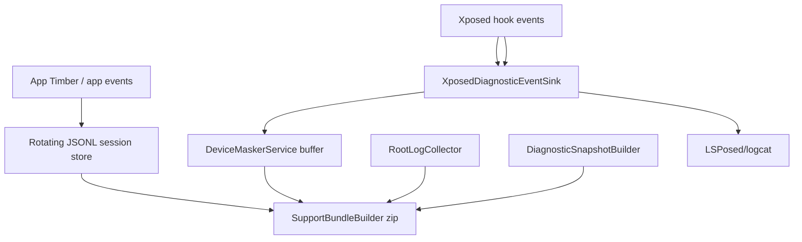

# Maximum Diagnostics Logging Architecture - 2026-05-03

## Pipeline

## Support Bundle Contents

- Basic: manifest, README, app diagnostic events, diagnostics service events.
- Full Debug: Basic plus redacted config, RemotePreferences, scope, summary, and hook health snapshots.
- Root Maximum: Full Debug plus bounded root artifacts: logcat buffers, filtered DeviceMasker/LSPosed logcat, ANR listings/traces, tombstones, dumpsys package/activity output, and getprop output.

## Privacy And Redaction

Exports are redacted by default. The shared redactor removes IMEI, IMSI, ICCID, MAC addresses, Android IDs, phone numbers, and location pairs. Package names are hashed with SHA-256 first 8 hex chars for snapshot fields.

No cloud logging, crash SDK, analytics SDK, or network telemetry is used. Root Maximum is local-only and opt-in.

## Root Collection Model

Root collection runs fixed command templates through `su -c`, with timeouts and stdout byte caps. Commands are not built from arbitrary user input. Stderr is preserved for failure diagnosis. Root artifacts are written into the support bundle only when Root Maximum mode is selected.

## Runtime Validation

LSPosed logs remain authoritative for target-process hook registration and spoof events. The diagnostics service is best-effort and can be unavailable under SELinux. Runtime proof still requires installing the APK, enabling LSPosed scope, force-stopping target apps, relaunching, and checking LSPosed/logcat evidence.

## Known Limitations

- Root Maximum has unit coverage for command construction and artifact layout, but still needs rooted-device smoke validation.
- Support bundles currently include app and service events directly; manual LSPosed export is still useful when root logcat is unavailable.
- Target runtime smoke for `com.mantle.verify` has not been rerun after this diagnostics implementation.
