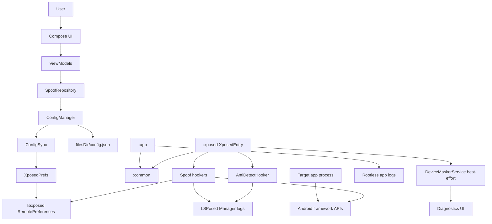
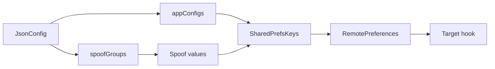
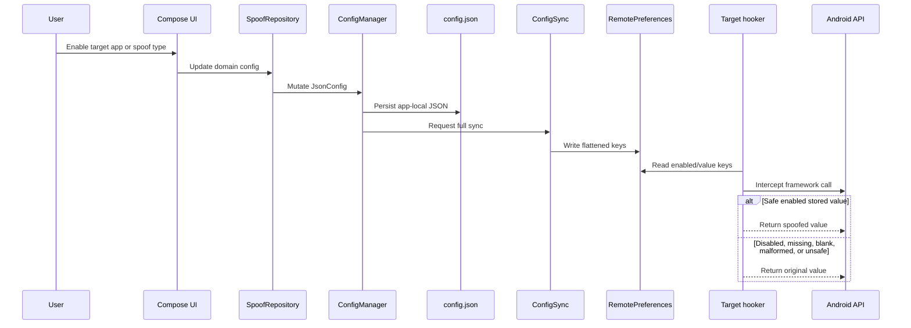
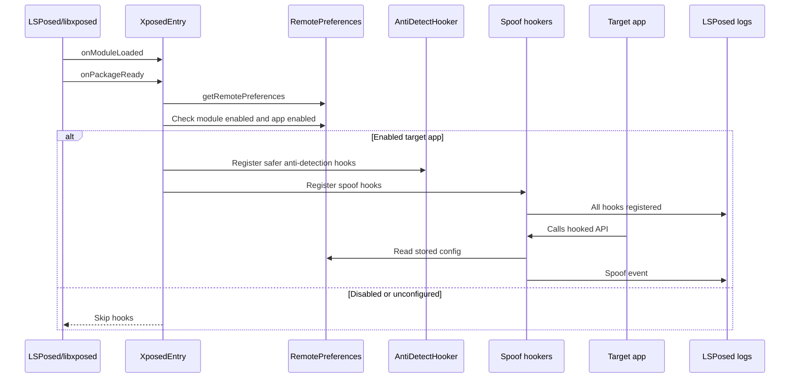
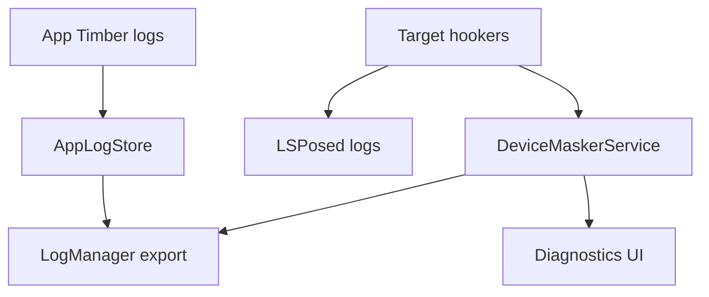
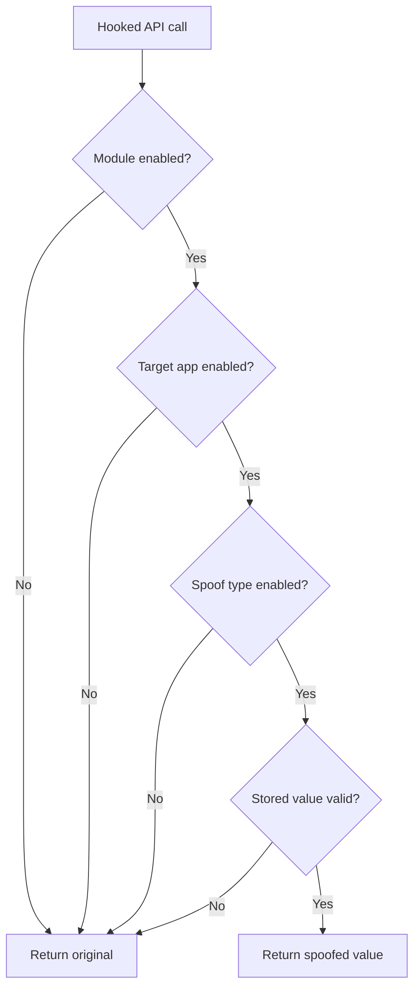

# Device Masker Architecture And Runtime Guide

Date: 2026-05-02

Status: active development with first working target-app smoke pass.

## Summary

Device Masker is an Android LSPosed/libxposed module that lets a user configure stable alternate identities for selected apps. The app owns configuration and value generation. The Xposed module reads the synchronized config from libxposed RemotePreferences inside target app processes and hooks selected Android framework APIs.

The project now has a working base: `com.mantle.verify` launched under LSPosed on `emulator-5554`, Device Masker hooks registered, and LSPosed logs showed live spoof events for multiple identifiers. This proves the core architecture works. It does not make the app stable-release ready yet.

## Architecture Goals

- Keep target apps alive.
- Deliver spoof config through libxposed RemotePreferences.
- Generate stable identities app-side, not inside hooks.
- Keep shared contracts in `:common`.
- Keep target-process hook logic in `:xposed`.
- Keep UI, local JSON, and config sync in `:app`.
- Use LSPosed logs as the reliable proof of runtime hook behavior.
- Treat custom diagnostics Binder as best-effort.

## High-Level Architecture



## Module Responsibilities

| Module | Responsibility | Must Not Do |
| --- | --- | --- |
| `:app` | UI, local config, config persistence, RemotePreferences writes, rootless logs, diagnostics UI | Run target-process hook logic |
| `:common` | Shared models, generators, `SharedPrefsKeys`, AIDL contract | Depend on Compose or Xposed runtime |
| `:xposed` | libxposed entry, hooks, anti-detection, LSPosed logging, best-effort diagnostics service | Generate fresh spoof identities or read app-private JSON |

## Configuration Model



Rules:
- `JsonConfig.appConfigs` is canonical.
- `SpoofGroup.assignedApps` is legacy/display compatibility only.
- `SharedPrefsKeys` builds all RemotePreferences keys.
- `ConfigSync` writes flattened per-app keys.
- Full sync clears stale package keys.
- Hookers read stored values only.

## Config Flow



## Runtime Hook Flow



## Diagnostics And Logs



Important facts:
- App logs are stored without root in app-owned storage.
- LSPosed logs are the authoritative hook-side runtime evidence.
- `DeviceMaskerService` diagnostics are best-effort and may be blocked by SELinux.
- Target app processes must not discover custom diagnostics through `ServiceManager`.
- App export should stay minimal and structured.

## Current Working Base

Validated runtime:
- Emulator: `emulator-5554`.
- Target: `com.mantle.verify`.
- Module state: enabled in LSPosed.
- Scope includes target app.
- Result: target app launched and stayed alive in the final smoke check.
- LSPosed logs showed:
  - `XposedEntry loaded for process: com.mantle.verify`
  - `Anti-detection hooks registered`
  - `All hooks registered for: com.mantle.verify`
  - spoof events for multiple identifiers.

Observed spoof events:
- `ANDROID_ID`
- `CARRIER_MCC_MNC`
- `NETWORK_OPERATOR`
- `IMEI`
- `WIFI_MAC`
- `WIFI_SSID`
- `ADVERTISING_ID`
- `MEDIA_DRM_ID`
- `SIM_OPERATOR_NAME`

Absent in the final launch window:
- `WorkManagerInitializer` startup crash.
- WebView regex `PatternSyntaxException`.
- `Cannot hook abstract methods` WebView warning.
- `AbstractMethodError` hooker lambda crash.
- `AntiDetectHooker` class-loading ANR.

## Lessons From The First Working Base

### R8 Can Break Hooker Lambdas

Release minification caused invalid runtime behavior for libxposed hook lambdas in target processes. Release shrinking and minification are disabled during validation.

### Target Apps Must Not Use Custom Diagnostics Binder Lookup

Target app processes cannot reliably discover custom diagnostics services through `ServiceManager` on SELinux-enforcing Android user builds. Hook-side events must go to LSPosed logs.

### Global Class Lookup Hooks Are Too Risky By Default

Global `Class.forName` and `ClassLoader.loadClass` hooks were on the crash path for AndroidX Startup / WorkManager discovery and class-loading ANRs. They are currently not registered by default.

### WebView Hooks Must Be Defensive

WebView UA parsing must not use static regex initializers that can throw. Abstract `WebSettings` declarations must be skipped.

## Forbidden Patterns

Do not:
- Use AIDL as the config delivery path.
- Generate identifiers inside target-process hooks.
- Return fake fallback values for malformed config.
- Read app-private JSON from target apps.
- Use Timber in `:xposed`.
- Hardcode preference keys outside `SharedPrefsKeys`.
- Hook abstract methods.
- Mutate framework-returned lists in place.
- Add static regex or parsing initializers that can throw in hooker objects.
- Re-enable global class lookup anti-detection without a per-app kill switch and runtime validation.
- Claim a target is hooked because the app-side Xposed service is connected.

## Required Hook Fallback Behavior



## Validation Checklist

Before claiming a target app works:
- Build passes.
- Debug APK installed.
- Device Masker enabled as LSPosed module.
- Target app is in LSPosed scope.
- Target app force-stopped after changes.
- LSPosed logs show `XposedEntry loaded`.
- LSPosed logs show `All hooks registered`.
- Target process remains alive after startup.
- LSPosed logs show spoof events.
- No fatal crash signatures appear.
- At least one target-side identifier display confirms spoofed values.

## Build And Verification

Full gate:

```powershell
.\gradlew.bat spotlessApply spotlessCheck :common:testDebugUnitTest :app:testDebugUnitTest :xposed:testDebugUnitTest lint test assembleDebug assembleRelease --no-daemon
```

Install:

```powershell
adb install -r app\build\outputs\apk\debug\app-debug.apk
```

Target smoke:

```powershell
adb shell am force-stop com.mantle.verify
adb logcat -c
adb shell monkey -p com.mantle.verify -c android.intent.category.LAUNCHER 1
adb shell pidof com.mantle.verify
adb logcat -d -t 1200
```

Useful log filters:

```powershell
adb logcat -d -t 1200 | Select-String -Pattern 'com.mantle.verify|DeviceMasker|AntiDetectHooker|WebViewHooker|LSPosedFramework|WorkManagerInitializer|PatternSyntaxException|Cannot hook abstract|FATAL EXCEPTION|Crash unexpectedly|failed to attach|start timeout'
```

## Next Architecture Work

Recommended next steps:
- Add per-app safe-mode toggles for risky hook groups.
- Add per-app class lookup anti-detection kill switch before reintroducing class lookup hooks.
- Add tests for more hook value conversion helpers.
- Validate additional target apps.
- Confirm actual returned values, not only spoof event logs.
- Improve UI wording for service connected, module scoped, target hooked, and spoof observed.
- Clean Gradle and Spotless deprecation warnings.
