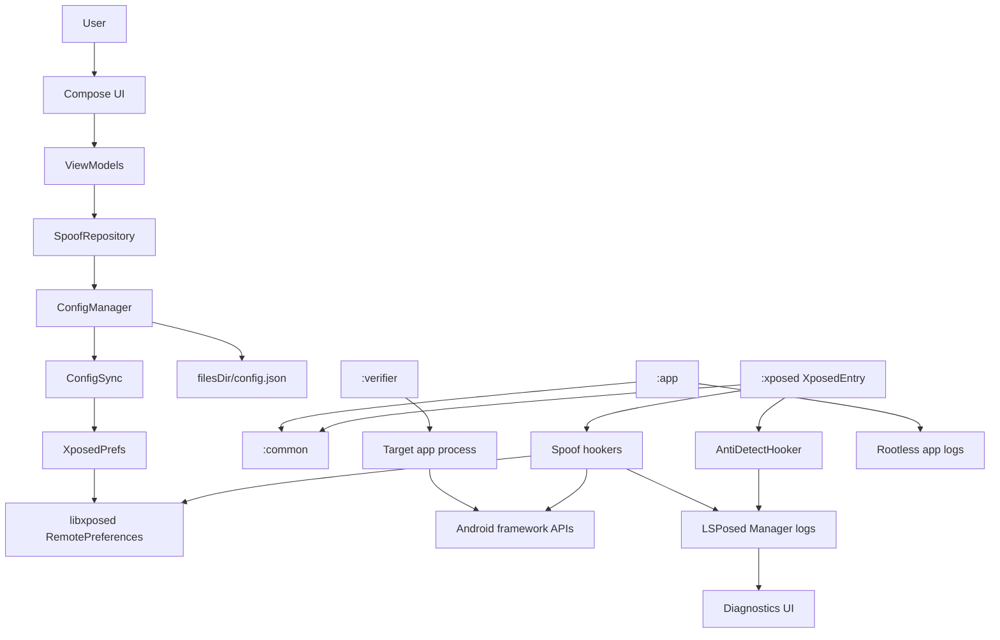
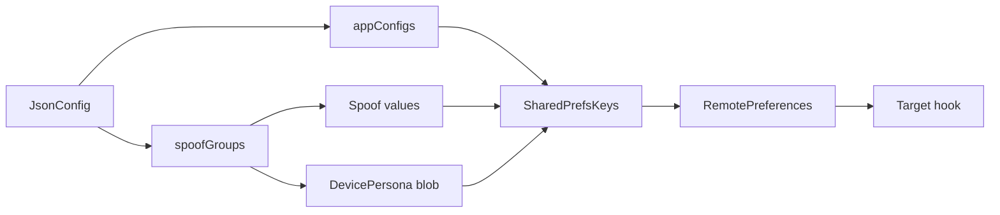
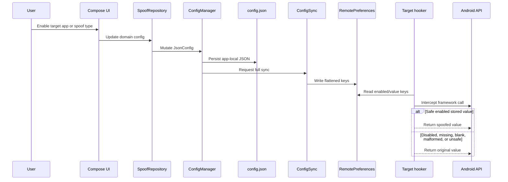
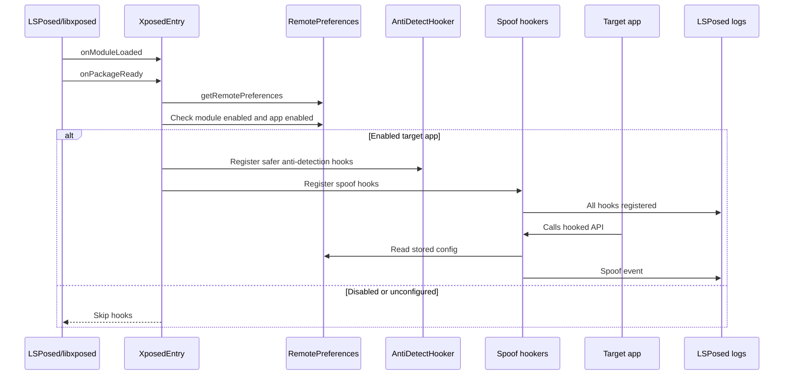
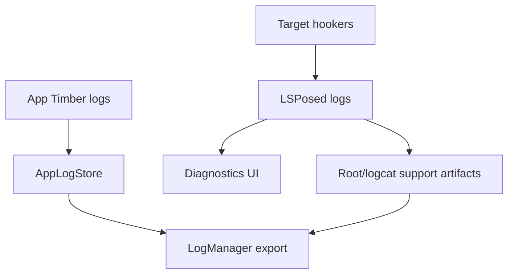
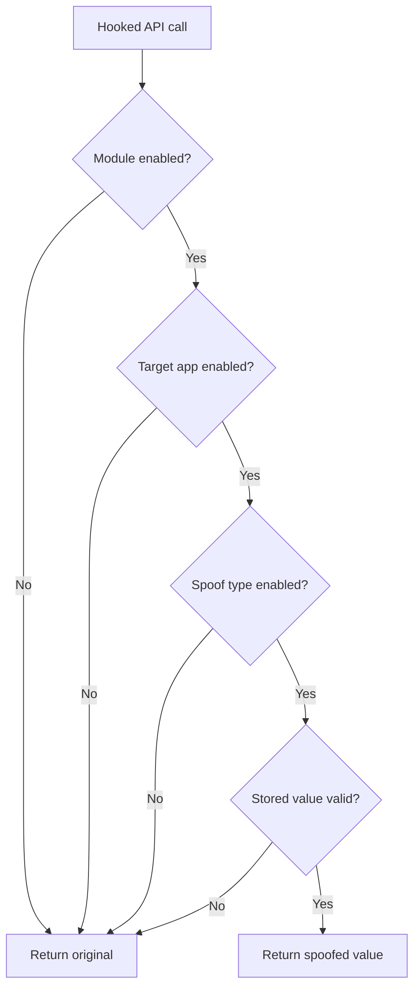

# Device Masker Architecture And Runtime Guide

Date: 2026-05-09

## Summary

Device Masker is an Android LSPosed/libxposed module that lets a user configure stable alternate identities for selected apps. The app owns configuration and value generation. The Xposed module reads the synchronized config from libxposed RemotePreferences inside target app processes and hooks selected Android framework APIs.

## Architecture Goals

- Keep target apps alive.
- Deliver spoof config through libxposed RemotePreferences.
- Generate stable identities app-side, not inside hooks.
- Keep shared contracts in `:common`.
- Keep target-process hook logic in `:xposed`.
- Keep UI, local JSON, and config sync in `:app`.
- Keep local validation in `:verifier`, separate from the production APK.
- Use LSPosed logs as the reliable proof of runtime hook behavior.
- Do not use a custom diagnostics Binder.
- Keep release R8 enabled; runtime hook callbacks must use the `StableHooker` path.

## High-Level Architecture

## Module Responsibilities

| Module | Responsibility | Must Not Do |
| --- | --- | --- |
| `:app` | UI, local config, config persistence, RemotePreferences writes, rootless logs, diagnostics UI | Run target-process hook logic |
| `:common` | Shared models, generators, `SharedPrefsKeys`, `DevicePersona`, config contracts | Depend on Compose or Xposed runtime |
| `:xposed` | libxposed entry, hooks, anti-detection, LSPosed logging | Generate fresh spoof identities or read app-private JSON |
| `:verifier` | Local target app that reads framework surfaces and writes `files/verifier/latest.json` | Ship as the production app |

## Configuration Model

Rules:
- `JsonConfig.appConfigs` is canonical.
- `SpoofGroup.assignedApps` is legacy/display compatibility only.
- `SharedPrefsKeys` builds all RemotePreferences keys.
- `ConfigSync` writes flattened per-app keys plus a coherent per-package `DevicePersona` blob/version.
- Full sync clears stale package keys.
- Hookers read stored values only; persona fallback is allowed only after a spoof type is enabled.

## Config Flow

## Runtime Hook Flow

## Diagnostics And Logs

Important facts:
- App logs are stored without root in app-owned storage.
- LSPosed logs are the authoritative hook-side runtime evidence.
- Support export has one user-facing path: Export Logs.
- Export Logs builds the maximum local support bundle.
- The bundle includes app JSONL events, redacted diagnostic snapshots, latest boot/startup root capture, and a fresh export-time root/logcat snapshot when root is granted.
- If root is unavailable, export still creates a ZIP with app logs, snapshots, and a root-unavailable manifest.
- There is no custom Device Masker Binder service in system_server.
- App export should stay structured, bounded, redacted, and useful for support.

## Forbidden Patterns

Do not:
- Add a custom AIDL/Binder path for spoof config or hook evidence.
- Generate identifiers inside target-process hooks.
- Return fake fallback values for malformed config.
- Read app-private JSON from target apps.
- Use Timber in `:xposed`.
- Hardcode preference keys outside `SharedPrefsKeys`.
- Hook abstract methods.
- Mutate framework-returned lists in place.
- Add static regex or parsing initializers that can throw in hooker objects.
- Use direct Kotlin SAM intercept callbacks in runtime hookers; use `StableHooker` instead.
- Re-enable global class lookup anti-detection without a per-app kill switch and runtime validation.
- Claim a target is hooked because the app-side Xposed service is connected.

## Required Hook Fallback Behavior

