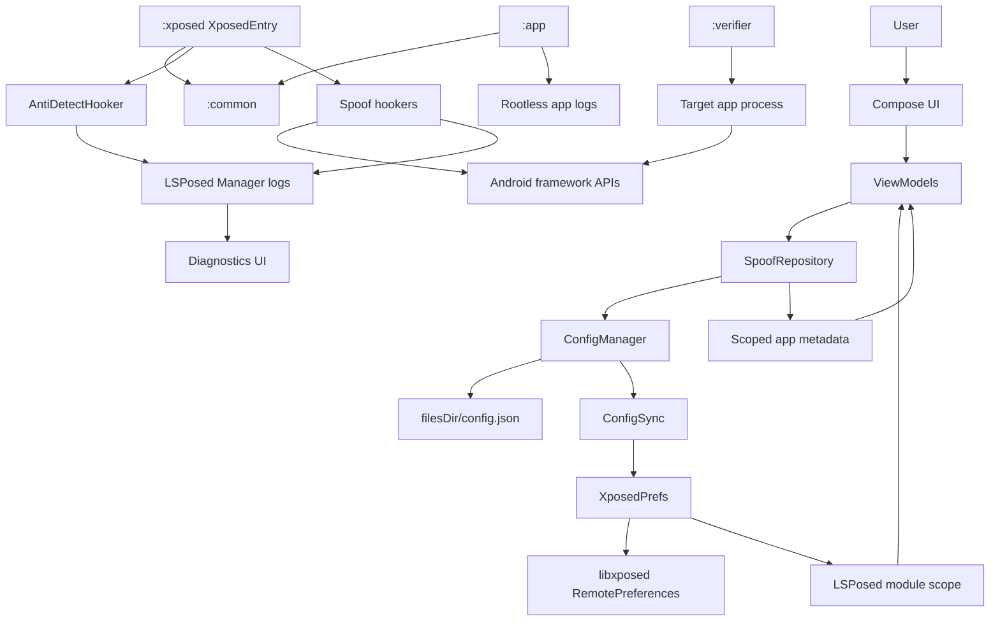
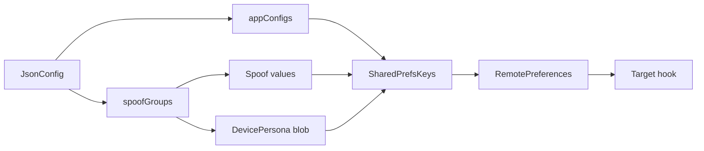
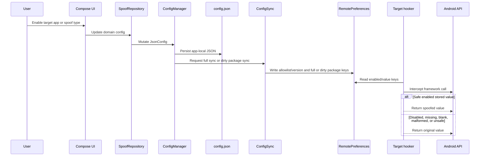
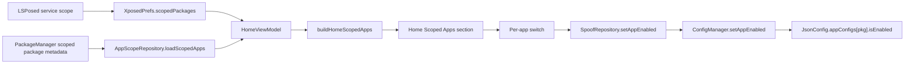
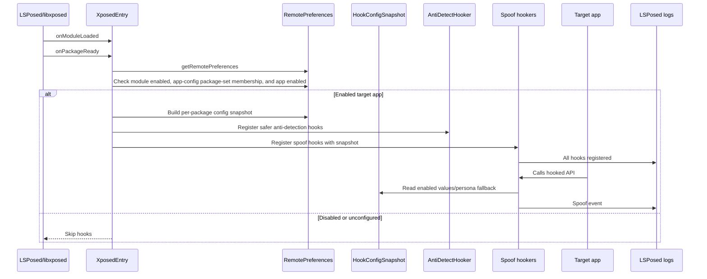
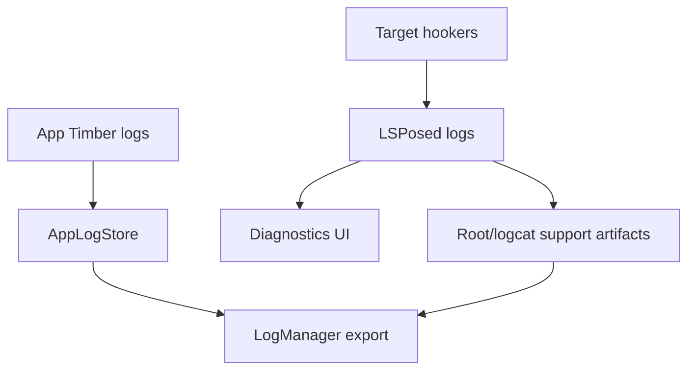
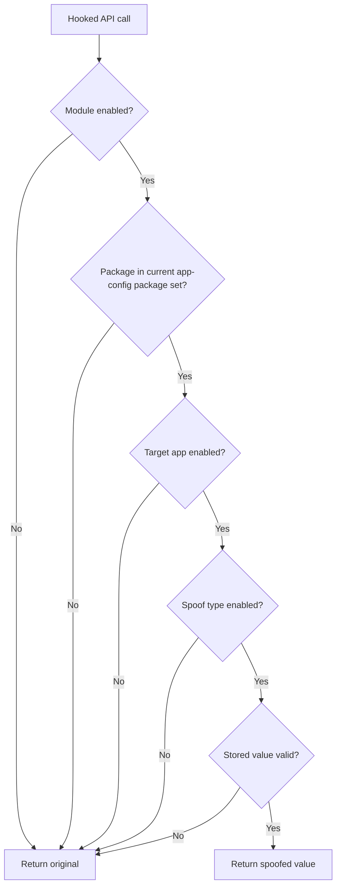

# Device Masker Architecture And Runtime Guide

Date: 2026-05-18

## Summary

Device Masker is an Android LSPosed/libxposed module that lets a user configure stable alternate identities for selected apps. The app owns configuration and value generation. The Xposed module reads the synchronized config from libxposed RemotePreferences inside target app processes and hooks selected Android framework APIs.

## Architecture Goals

- Keep target apps alive.
- Deliver spoof config through libxposed RemotePreferences.
- Generate stable identities app-side, not inside hooks.
- Keep shared contracts in `:common`.
- Keep target-process hook logic in `:xposed`.
- Keep UI, local JSON, and config sync in `:app`.
- Keep local validation in `:verifier`, separate from the production APK.
- Use LSPosed logs as the reliable proof of runtime hook behavior.
- Do not use a custom diagnostics Binder.
- Keep release R8 enabled; runtime hook callbacks must use the `StableHooker` path.

## High-Level Architecture

## Module Responsibilities

| Module | Responsibility | Must Not Do |
| --- | --- | --- |
| `:app` | UI, local config, config persistence, RemotePreferences writes, rootless logs, diagnostics UI | Run target-process hook logic |
| `:common` | Shared models, generators, `SharedPrefsKeys`, `DevicePersona`, config contracts | Depend on Compose or Xposed runtime |
| `:xposed` | libxposed entry, hooks, anti-detection, LSPosed logging | Generate fresh spoof identities or read app-private JSON |
| `:verifier` | Local target app that reads framework surfaces and writes `files/verifier/latest.json` | Ship as the production app |

## Configuration Model

Rules:
- `JsonConfig.appConfigs` is canonical.
- `SpoofGroup.assignedApps` is legacy/display compatibility only.
- Runtime sync uses explicit enabled `AppConfig.groupId` assignment. Default-group fallback is not valid hook eligibility for an unassigned package.
- `AppConfig.isEnabled` is standalone app-level spoof eligibility. Group assignment and unassignment preserve it unless the user explicitly toggles the app.
- LSPosed scope is an app-side observation source for UI and refresh state. It is not runtime hook eligibility by itself.
- `SharedPrefsKeys` builds all RemotePreferences keys.
- `ConfigSync` writes flattened per-app keys plus a coherent per-package `DevicePersona` blob/version.
- Full sync clears stale package keys.
- Dirty package sync writes the current app-config package set/config version and only rewrites requested package keys.
- `ConfigSync` publishes the current app-config package set; `:xposed` requires package-set membership plus the per-package enabled key before registering target hooks.
- Hookers read stored values only; persona fallback is allowed only after a spoof type is enabled.

## Config Flow

## Home Scoped Apps Flow

The Home screen has a separate app-side flow for the "Scoped Apps" section. It shows apps currently selected in LSPosed scope and lets the user toggle app-level spoof eligibility without changing group assignment.

Rules:

- The list is derived from `XposedPrefs.scopedPackages` joined with scoped package metadata, not from spoof groups or `appConfigs`.
- Home startup must use `AppScopeRepository.loadScopedApps()` and must not trigger a full installed-app scan.
- `android` and `system` are filtered out of the Home list because they are framework scope entries, not user target apps.
- Packages missing from installed-app metadata are omitted instead of rendered as raw package names.
- Pull-to-refresh force-refreshes scoped package metadata and rereads LSPosed scope.
- Disabling an app here only sets `AppConfig.isEnabled = false`; it does not remove LSPosed scope or clear group assignment.
- Runtime hooks still require synced `enabled_apps` package-set membership, the per-package enabled key, an explicit enabled group assignment, and enabled spoof type values.

## Runtime Hook Flow

## Diagnostics And Logs

Important facts:
- `HookConfigSnapshot` is built once in `XposedEntry.onPackageReady()` for the selected package. Value hookers read the snapshot in callbacks; anti-detect and proc-maps policy still read their app-level preference keys.
- Hook registration keeps one final `All hooks registered` event plus health counters. Per-hook debug start/success spam is not part of the common path.
- App logs are stored without root in app-owned storage.
- LSPosed logs are the authoritative hook-side runtime evidence.
- Support export has one user-facing path: Export Logs.
- Export Logs builds the maximum local support bundle.
- The bundle includes app JSONL events, redacted diagnostic snapshots, latest boot/startup root capture, and a fresh export-time root/logcat snapshot when root is granted.
- Support bundle JSONL entries are streamed line by line into the ZIP; do not join large log files into memory.
- If root is unavailable, export still creates a ZIP with app logs, snapshots, and a root-unavailable manifest.
- There is no custom Device Masker Binder service in system_server.
- App export should stay structured, bounded, redacted, and useful for support.

## Android 16 Compatibility

Android 16 support is validated separately from Android 13 emulator smoke. Hook families can be isolated per target through RemotePreferences keys when a crash needs triage.

Java `/proc/self/maps` hardening is path-aware and owned by `ProcMapsHooker`. It covers tracked Java reader paths and keeps byte/NIO redaction behind explicit per-app policy keys. Native scanner coverage is not claimed unless a later native probe and target-app evidence prove it.

For the current validation matrix, emulator evidence, and evidence boundaries, see `docs/public/validation/DEVICE_MASKER_VALIDATION_STATUS.md`.

## Verifier Evidence

`:verifier` is the local target app for value-by-value checks. It stays simple and machine-readable: launch the target, read Android framework surfaces, and write `files/verifier/latest.json`.

Current validation rules:
- Treat LSPosed/logcat hook registration as hook-load evidence.
- Treat verifier JSON as target-app value evidence.
- Compare verifier values against the live Device Masker config snapshot for expected-vs-actual reports.
- Keep Android platform restrictions and unsupported verifier probe shapes separate from real spoof failures.
- Do not claim complete WebView UA spoofing from static UA checks alone; instance `WebSettings.getUserAgentString()` must also be verified.
- WebView instance UA is handled through `WebView.getSettings()` concrete settings discovery; broad classloader hooks remain disabled by default.

## Forbidden Patterns

Do not:
- Add a custom AIDL/Binder path for spoof config or hook evidence.
- Generate identifiers inside target-process hooks.
- Return fake fallback values for malformed config.
- Read app-private JSON from target apps.
- Use Timber in `:xposed`.
- Hardcode preference keys outside `SharedPrefsKeys`.
- Hook abstract methods.
- Mutate framework-returned lists in place.
- Add static regex or parsing initializers that can throw in hooker objects.
- Use direct Kotlin SAM intercept callbacks in runtime hookers; use `StableHooker` instead.
- Re-enable global class lookup anti-detection without a per-app kill switch and runtime validation.
- Claim a target is hooked because the app-side Xposed service is connected.

## Required Hook Fallback Behavior

