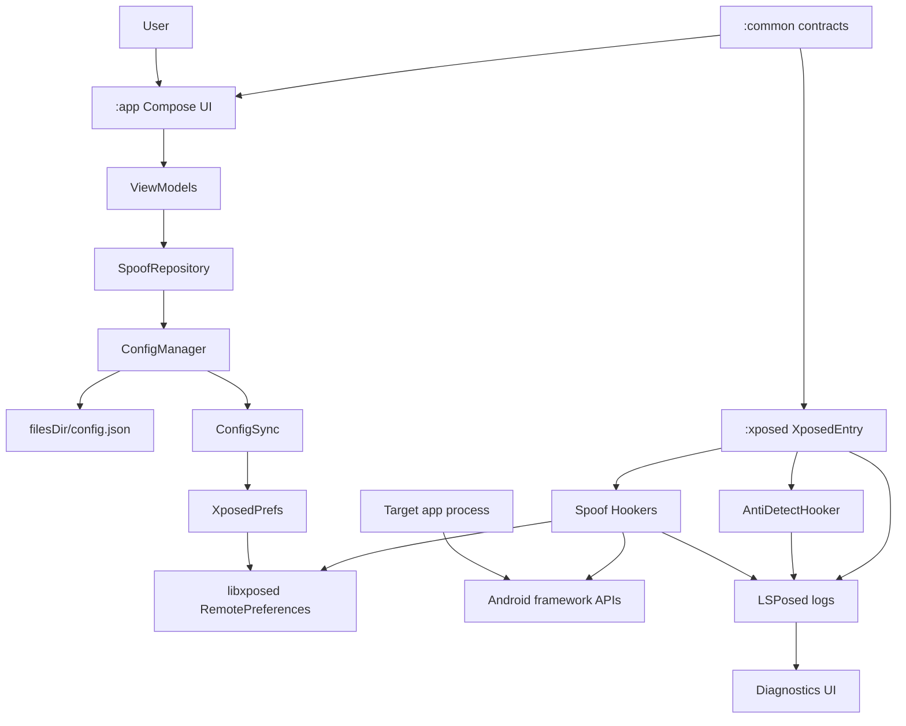
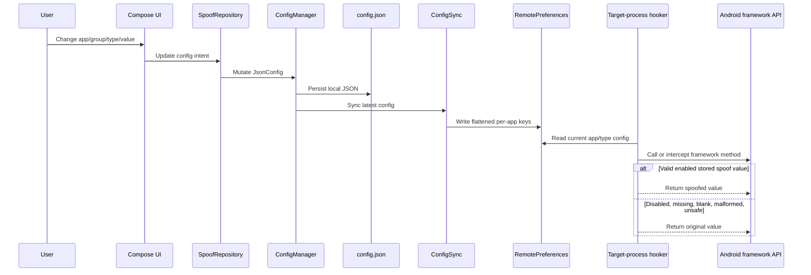
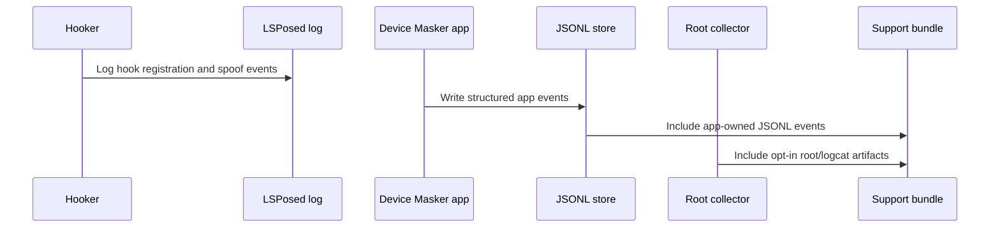

# System Patterns: Device Masker

## Module Layout

```text
:app
  Compose UI, ViewModels, repositories, JSON persistence, RemotePreferences writer,
  rootless app logs, diagnostics client.

:common
  Shared models, config contracts, preference keys, generators.

:xposed
  libxposed module entry, hookers, RemotePreferences reader, hook safety helpers,
  anti-detection, LSPosed logging.
```

## Architecture



## Configuration Flow



## Source Of Truth Rules

- `JsonConfig.appConfigs` is the canonical app assignment and enablement table.
- `SpoofGroup.assignedApps` is legacy/display compatibility only.
- `SharedPrefsKeys` in `:common` is the only source for RemotePreferences key names.
- Generators live in `:common`.
- Hookers read stored values; hookers do not generate new identities at runtime.
- `ConfigSync` must clear stale package keys on full sync.
- Config delivery is RemotePreferences-first.
- Do not add custom AIDL/Binder config or hook-evidence paths.

## Hook Loading Rules

`XposedEntry`:
- Runs system-server setup from `onSystemServerStarting`.
- Runs target app hooks from `onPackageReady`.
- Skips `android` in app hook path because system server has its own lifecycle.
- Skips own app and critical system packages.
- Hooks only the first package load per classloader.
- Requires global module enabled and per-app enabled preferences before registering app hooks.
- Logs `All hooks registered` to LSPosed when target hook registration completes.

## Hook Safety Rules

Every hook should:
- Resolve classes and methods defensively.
- Use libxposed API 101 through `intercept(stableHooker { ... })` or explicit named
  `XposedInterface.Hooker` classes. Direct `.intercept { ... }` Kotlin SAM callbacks are forbidden
  in runtime hookers because release R8 caused `AbstractMethodError` in LSPosed target processes.
- Use one `safeHook` block per method or method family.
- Call `xi.deoptimize(m)` for methods that are hooked.
- Call `chain.proceed()` when original values are needed for fallback.
- Return original values for disabled, missing, blank, malformed, unsafe, or unsupported config.
- Skip abstract methods and other unhookable framework declarations.
- Avoid static initializers that can throw inside target processes.

Forbidden in target-process hook callbacks:
- Random fallback identifier generation.
- Hardcoded fake defaults for malformed config.
- Direct Kotlin SAM callback registration with `xi.hook(m).intercept { ... }`.
- Direct reads of app-private JSON config.
- Timber usage in `:xposed`.
- Hardcoded RemotePreferences key strings.
- In-place mutation of framework-returned lists.
- Custom `ServiceManager` lookup for Device Masker diagnostics.

## Anti-Detection Pattern

Current safer anti-detection surfaces:
- Stack trace filtering.
- `/proc/self/maps` line filtering.
- Package visibility hiding through PackageManager hooks.
- Package list filtering with copied lists.

Global class lookup hiding is currently disabled by default:
- `Class.forName` and `ClassLoader.loadClass` hooks are too invasive for target startup.
- They caused or contributed to startup instability in `com.mantle.verify`.
- The helper still has safe-prefix pass-through rules for opt-in use.
- Reintroduction now requires both per-app risky hooks and per-app class lookup hiding to be enabled.

Intentional app-visible throws for package/class hiding must use `ExceptionMode.PASSTHROUGH`.

## Diagnostics Pattern



Diagnostics facts:
- App logs are rootless structured `DiagnosticEvent` JSONL stored in app sandbox.
- Support export has one user-facing `Export Logs` path backed by the maximum root/logcat bundle.
- Exports are redacted by default; raw identifiers must not be logged by default.
- Root/logcat collection uses bounded fixed command templates during boot/startup capture and export-time fresh snapshot.
- LSPosed logs are the authoritative source for target-process hook events.
- There is no custom Device Masker Binder service in system_server.
- Diagnostics UI does not read custom service status; target hook proof comes from LSPosed/logcat.

## Current Hook Areas

- `AntiDetectHooker`
- `DeviceHooker`
- `NetworkHooker`
- `AdvertisingHooker`
- `SystemHooker`
- `LocationHooker`
- `SensorHooker`
- `WebViewHooker`
- `SubscriptionHooker`
- `PackageManagerHooker`

## Value Correlation

Values must remain coherent across related APIs:
- SIM/carrier: IMSI, ICCID, phone number, carrier name, MCC, MNC, SIM country, network country.
- Device profile: manufacturer, brand, model, device, product, board, hardware, fingerprint, serial.
- Location profile: latitude, longitude, timezone, locale.
- Network profile: Wi-Fi MAC, SSID, BSSID, operator, Bluetooth address.

## WebView Pattern

WebView UA spoofing is defensive:
- Do not use static regex initializers.
- Parse UA strings with safe string operations.
- Replace only recognizable Android model segments.
- Pass through unknown formats.
- Skip abstract `WebSettings` methods.
- When changing `setUserAgentString(String)` arguments, copy `chain.args` and call
  `chain.proceed(Object[])`; libxposed returns an immutable args list.

## libxposed Error Handling Pattern

- `HookFailedError` extends `XposedFrameworkError`, which extends `Error`.
- Hook registration and deoptimization wrappers must rethrow `XposedFrameworkError` before any
  generic `Throwable` catch.
- Normal reflection/OEM API variation failures can still be logged and skipped so one missing method
  does not block unrelated hooks.

## Process Package Selection Pattern

- `onModuleLoaded` captures the process name for later package selection.
- `onPackageReady` considers the loaded package and process base package, then picks the first
  package enabled in RemotePreferences.
- Hooks still register once per classloader to avoid duplicated hook chains.
- This improves secondary package handling but does not make one classloader support multiple
  simultaneous per-package identities.

## RemotePreferences Write Pattern

- Config delivery remains RemotePreferences-first.
- App-side config sync uses explicit `commit()` where sync success matters.
- Async `apply()` should not be used for config writes that the UI or diagnostics report as synced.

## Build Pattern

- Release minification and resource shrinking are enabled.
- Release R8 safety depends on the `StableHooker` adapter in `:xposed`; keep rules must preserve
  `io.github.libxposed.api.XposedInterface$Hooker`, `Chain`, `HookBuilder`, `HookHandle`, and
  `com.astrixforge.devicemasker.xposed.hooker.callback.**`.
- `ciRelease` build type validates ProGuard rules without affecting debug builds.
- Lint is fail-fast.
- Spotless covers Kotlin and Gradle Kotlin files, excluding docs and generated/build folders.
- Detekt runs for `:app`, `:common`, and `:xposed` using `config/detekt.yml`, module overrides, and per-module baselines.
- Detekt runs with `allRules=true`; module baselines are currently empty and should stay empty.
- Compose compiler reports/metrics are opt-in through `enableComposeCompilerReports` and `enableComposeCompilerMetrics`.
- Memory Bank must be updated after architecture or runtime behavior changes.

## App Contract Pattern

- `IConfigManager` and `ISpoofRepository` are compatibility facades over smaller workflow-focused interfaces.
- Prefer narrow interfaces for new call sites when practical.
- `ConfigManager` and `SpoofRepository` carry targeted `TooManyFunctions` suppressions only because they are compatibility facades; do not treat those suppressions as permission to grow random APIs.

## Testing Pattern

- `MainDispatcherRule` swaps `Dispatchers.Main` for a `TestDispatcher` in ViewModel tests.
- Hand-written fakes preferred over mocking libraries per module rules.
- Turbine used for Flow emission testing.
- MockK permitted only for Navigation 3 framework types.
- Fake repositories carry real state and test hooks.
- `advanceUntilIdle()` required after async operations in `runTest`.

## ViewModel State Pattern

- `SavedStateHandle` injected for process-death survival of critical UI state.
- State classes annotated `@Immutable` with `kotlinx.collections.immutable.ImmutableList`.
- `Flow.combine` used to merge multiple repository flows into single UI state.
- Redundant `suspend` modifiers removed from non-suspending methods.

## Navigation Pattern

- Navigation uses Navigation 3, not Navigation Compose 2.x.
- `NavDestination` is the typed `NavKey` sealed interface for Home, Groups, GroupSpoofing, Settings, and Diagnostics.
- `DeviceMaskerNavigationState` owns separate top-level Home, Groups, and Settings back stacks.
- The selected top-level destination is saved with `rememberSaveable`; individual stacks are saved with `rememberNavBackStack`.
- `DeviceMaskerNavigator` is the narrow imperative API screens use for navigation intents.
- `NavDisplay` renders the active stack through typed `entryProvider` entries.
- `rememberSaveableStateHolderNavEntryDecorator` and `rememberViewModelStoreNavEntryDecorator` preserve entry state and ViewModel stores.
- Navigation motion is configured through `NavDisplay` transition specs and uses M3E motion tokens with reduced-motion fallback.
- Window size class adaptation: `NavigationRail` for medium/expanded, bottom navigation for compact, both hidden on focus/detail screens.
- Groups and GroupSpoofing use adaptive Navigation 3 list-detail scene metadata.
- Compact width intentionally uses Navigation 3's default single-pane scene; the Material list-detail scene strategy is only passed on medium/expanded widths after compact runtime validation showed excessive scene startup cost.
- Deep links use explicit `devicemasker://open/...` URI parsing and synthetic stacks. `groups/{groupId}` opens Groups -> GroupSpoofing, and `diagnostics` opens Settings -> Diagnostics so Back returns to the parent top-level destination.
