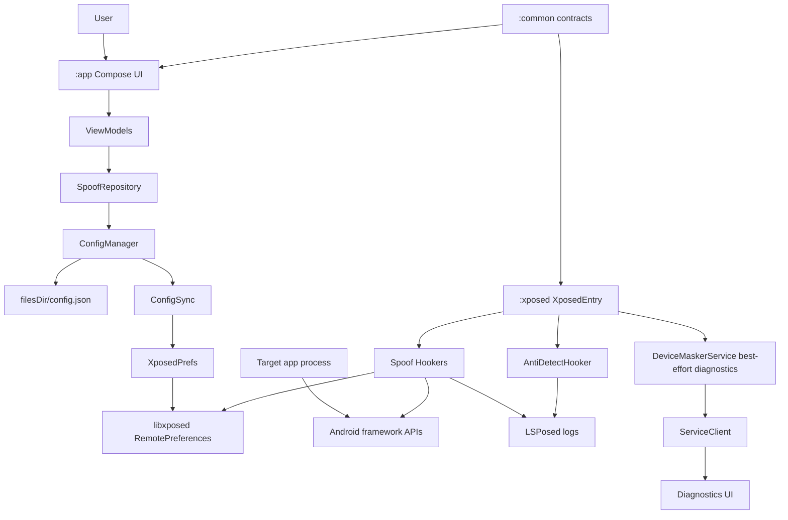
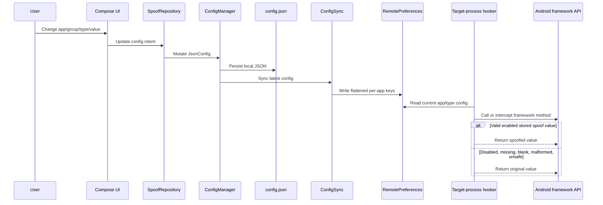
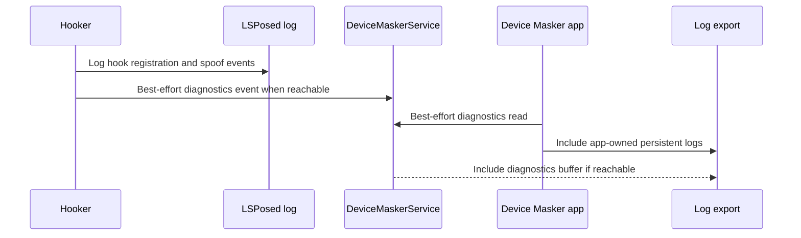

# System Patterns: Device Masker

## Module Layout

```text
:app
  Compose UI, ViewModels, repositories, JSON persistence, RemotePreferences writer,
  rootless app logs, diagnostics client.

:common
  Shared models, config contracts, preference keys, generators, AIDL contract.

:xposed
  libxposed module entry, hookers, RemotePreferences reader, hook safety helpers,
  anti-detection, diagnostics service, LSPosed logging.
```

## Architecture



## Configuration Flow



## Source Of Truth Rules

- `JsonConfig.appConfigs` is the canonical app assignment and enablement table.
- `SpoofGroup.assignedApps` is legacy/display compatibility only.
- `SharedPrefsKeys` in `:common` is the only source for RemotePreferences key names.
- Generators live in `:common`.
- Hookers read stored values; hookers do not generate new identities at runtime.
- `ConfigSync` must clear stale package keys on full sync.
- Config delivery is RemotePreferences-first.
- AIDL is diagnostics-only and must not deliver spoof config.

## Hook Loading Rules

`XposedEntry`:
- Runs system-server setup from `onSystemServerStarting`.
- Runs target app hooks from `onPackageReady`.
- Skips `android` in app hook path because system server has its own lifecycle.
- Skips own app and critical system packages.
- Hooks only the first package load per classloader.
- Requires global module enabled and per-app enabled preferences before registering app hooks.
- Logs `All hooks registered` to LSPosed when target hook registration completes.

## Hook Safety Rules

Every hook should:
- Resolve classes and methods defensively.
- Use libxposed API 101 lambda interceptors.
- Use one `safeHook` block per method or method family.
- Call `xi.deoptimize(m)` for methods that are hooked.
- Call `chain.proceed()` when original values are needed for fallback.
- Return original values for disabled, missing, blank, malformed, unsafe, or unsupported config.
- Skip abstract methods and other unhookable framework declarations.
- Avoid static initializers that can throw inside target processes.

Forbidden in target-process hook callbacks:
- Random fallback identifier generation.
- Hardcoded fake defaults for malformed config.
- Direct reads of app-private JSON config.
- Timber usage in `:xposed`.
- Hardcoded RemotePreferences key strings.
- In-place mutation of framework-returned lists.
- Custom `ServiceManager` lookup for Device Masker diagnostics.

## Anti-Detection Pattern

Current safer anti-detection surfaces:
- Stack trace filtering.
- `/proc/self/maps` line filtering.
- Package visibility hiding through PackageManager hooks.
- Package list filtering with copied lists.

Global class lookup hiding is currently disabled by default:
- `Class.forName` and `ClassLoader.loadClass` hooks are too invasive for target startup.
- They caused or contributed to startup instability in `com.mantle.verify`.
- The helper still has safe-prefix pass-through rules for future reintroduction.
- Reintroduce only behind a per-app kill switch and regression tests.

Intentional app-visible throws for package/class hiding must use `ExceptionMode.PASSTHROUGH`.

## Diagnostics Pattern



Diagnostics facts:
- App logs are rootless and stored in app sandbox.
- LSPosed logs are the authoritative source for target-process hook events.
- Custom system-server diagnostics Binder can be blocked by SELinux.
- Target app processes must not discover `user.devicemasker_diag`.

## Current Hook Areas

- `AntiDetectHooker`
- `DeviceHooker`
- `NetworkHooker`
- `AdvertisingHooker`
- `SystemHooker`
- `LocationHooker`
- `SensorHooker`
- `WebViewHooker`
- `SubscriptionHooker`
- `PackageManagerHooker`
- `SystemServiceHooker`

## Value Correlation

Values must remain coherent across related APIs:
- SIM/carrier: IMSI, ICCID, phone number, carrier name, MCC, MNC, SIM country, network country.
- Device profile: manufacturer, brand, model, device, product, board, hardware, fingerprint, serial.
- Location profile: latitude, longitude, timezone, locale.
- Network profile: Wi-Fi MAC, SSID, BSSID, operator, Bluetooth address.

## WebView Pattern

WebView UA spoofing is defensive:
- Do not use static regex initializers.
- Parse UA strings with safe string operations.
- Replace only recognizable Android model segments.
- Pass through unknown formats.
- Skip abstract `WebSettings` methods.

## Build Pattern

- Release minification and resource shrinking stay disabled during hook validation.
- Lint is fail-fast.
- Spotless covers Kotlin and Gradle Kotlin files, excluding docs and generated/build folders.
- Memory Bank must be updated after architecture or runtime behavior changes.
