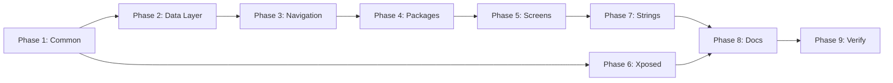

# Tasks: Profile → Group Rename

## Summary
- **Total Tasks**: 25
- **Estimated Time**: 2-3 hours
- **Risk Level**: Medium (breaking change with migration)

---

## Phase 1: Common Module (Foundation)

- [x] 1.1 Rename `SpoofProfile.kt` → `SpoofGroup.kt`
  - Class: `SpoofProfile` → `SpoofGroup`
  - All method docs and comments
  - Companion object: `createDefaultProfile()` → `createDefaultGroup()`

- [x] 1.2 Update `JsonConfig.kt`
  - Field: `profiles` → `groups`
  - Add `@SerialName("profiles")` for backward compatibility
  - Type: `List<SpoofProfile>` → `List<SpoofGroup>`
  - Methods: `getProfileForApp()` → `getGroupForApp()`

- [x] 1.3 Update `AppConfig.kt`
  - Any profile references → group

- [x] 1.4 Update `Constants.kt` (if profile constants exist)
  - Keys and constant names

- [x] 1.5 Verify `:common` compiles
  - `./gradlew :common:compileDebugKotlin`

---

## Phase 2: App Module - Data Layer

- [x] 2.1 Update `SpoofRepository.kt`
  - `getProfiles()` → `getGroups()`
  - `saveProfile()` → `saveGroup()`
  - `deleteProfile()` → `deleteGroup()`
  - Variable names: `profile` → `group`

- [x] 2.2 Update `ConfigManager.kt`
  - All profile variable references → group
  - Method parameters and return types

- [x] 2.3 Update `TypeAliases.kt` (if profile aliases exist)

- [x] 2.4 Verify data layer compiles
  - `./gradlew :app:compileDebugKotlin` (may fail, continue)

---

## Phase 3: App Module - Navigation

- [x] 3.1 Update `NavDestination.kt`
  - `PROFILES` → `GROUPS`
  - `PROFILE_DETAIL` → `GROUP_SPOOFING`
  - `profileDetailRoute()` → `groupSpoofingRoute()`
  - `PROFILE_DETAIL_PATTERN` → `GROUP_SPOOFING_PATTERN`
  - Comments and docs

- [x] 3.2 Update `MainActivity.kt`
  - Navigation composable route references
  - Import updates

---

## Phase 4: App Module - Rename Packages

- [x] 4.1 Rename `profile/` package → `groups/`
  - `ProfileScreen.kt` → `GroupsScreen.kt`
  - `ProfileViewModel.kt` → `GroupsViewModel.kt`
  - `ProfileState.kt` → `GroupsState.kt`
  - Update package declarations
  - Update class names inside files

- [x] 4.2 Rename `profiledetail/` package → `groupspoofing/`
  - `ProfileDetailScreen.kt` → `GroupSpoofingScreen.kt`
  - `ProfileDetailViewModel.kt` → `GroupSpoofingViewModel.kt`
  - `ProfileDetailState.kt` → `GroupSpoofingState.kt`
  - All subdirectories stay in new package
  - Update all package declarations

---

## Phase 5: App Module - Components & Screens

- [x] 5.1 Rename `ProfileCard.kt` → `GroupCard.kt`
  - Composable function: `ProfileCard()` → `GroupCard()`
  - Parameters: `profile: SpoofProfile` → `group: SpoofGroup`

- [x] 5.2 Update `HomeScreen.kt`
  - Fix imports for renamed components
  - Variable names: `profile` → `group`

- [x] 5.3 Update `HomeViewModel.kt`
  - State field: `activeProfile` → `activeGroup`
  - Methods: `setActiveProfile()` → `setActiveGroup()`

- [x] 5.4 Update `HomeState.kt`
  - `profiles: List<SpoofProfile>` → `groups: List<SpoofGroup>`
  - `activeProfileId: String?` → `activeGroupId: String?`

- [x] 5.5 Fix all remaining import errors in `:app`
  - Run compile and fix each error

- [x] 5.6 Update `package-info.kt` files
  - `ui/screens/package-info.kt` - ProfileScreen reference
  - `ui/components/package-info.kt` - ProfileCard reference

---

## Phase 6: Xposed Module

- [x] 6.1 Update `DeviceMaskerService.kt`
  - Config reads: `profile` → `group` variable names
  - `getProfileForApp()` calls (method will be renamed in common)

- [x] 6.2 Update all Hookers
  - `DeviceHooker.kt` - `val profile =` → `val group =`
  - `NetworkHooker.kt` - `val profile =` → `val group =`
  - `AdvertisingHooker.kt` - `val profile =` → `val group =`
  - `SystemHooker.kt` - `val profile =` → `val group =` (keep DeviceProfilePreset)
  - `LocationHooker.kt` - `val profile =` → `val group =`

- [x] 6.3 Verify `:xposed` compiles
  - `./gradlew :xposed:compileDebugKotlin`

---

## Phase 7: String Resources

- [x] 7.1 Rename string keys in `strings.xml`
  - `profile_screen_*` → `group_screen_*` (15 strings)
  - `profile_detail_*` → `group_spoofing_*` (14 strings)
  - `profile_card_*` → `group_card_*` (1 plural)
  - `home_active_profile_label` → `home_active_group_label`
  - `home_profile_disabled_tag` → `home_group_disabled_tag`
  - `profile_import_*`, `profile_export_*` → `group_import_*`, `group_export_*`

- [x] 7.2 Update user-facing text
  - "Profile" → "Group" in visible strings
  - "Profiles" → "Groups" (plural)
  - "Create New Profile" → "Create New Group"
  - "Delete Profile" → "Delete Group"
  - "Edit Profile" → "Edit Group"
  - "No profiles found" → "No groups found"
  - "Active Profile" → "Active Group"
  - "Assigned to another profile" → "Assigned to another group"

- [x] 7.3 Update plurals in `strings.xml`
  - `profile_card_apps_count` → `group_card_apps_count`
  - `profile_detail_apps_assigned_stats` → `group_spoofing_apps_assigned_stats`

---

## Phase 8: Documentation

- [x] 8.1 Update Memory Bank files
  - `activeContext.md` - current work references
  - `productContext.md` - product description
  - `progress.md` - completion tracking
  - `projectbrief.md` - project overview
  - `systemPatterns.md` - architecture patterns
  - `techContext.md` - technical context

- [x] 8.2 Update OpenSpec specs
  - `core-infrastructure/spec.md` - terminology
  - `data-management/spec.md` - storage keys

- [x] 8.3 Update `openspec/project.md`
  - Architecture patterns section
  - Naming conventions section

---

## Phase 9: Verification

- [x] 9.1 Full build verification
  - `./gradlew assembleDebug`

- [x] 9.2 Grep for remaining "Profile" references (excluding DeviceProfilePreset)
  - Search: `profile` case-insensitive
  - Verify each match is either:
    - `DeviceProfilePreset` (intentional keep)
    - Or renamed to `group`

- [x] 9.3 Test on device
  - Verify navigation works
  - Verify groups load correctly
  - Verify spoofing still works
  - Test backward compat with old config

- [x] 9.4 Git commit with descriptive message
  - `refactor: rename Profile → Group terminology`

---

## Dependencies

## Parallel Work
- Phase 6 (Xposed) can start after Phase 1 completes
- Phase 7 (Strings) can start after Phase 5 completes
- Phase 8 (Docs) can start after Phase 5 completes

## Notes

- **KEEP `DeviceProfilePreset`**: This refers to hardware device profiles (Samsung Galaxy, Pixel), not spoof groups
- **Add `@SerialName`**: Critical for backward compatibility
- **Test existing configs**: Ensure old saved data still loads
- **`profileId` → `groupId`**: All variable/parameter names
